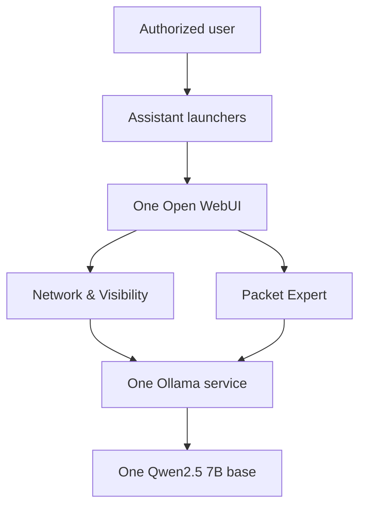

# NetTAP AI Suite

NetTAP AI Suite is a customer-isolated network engineering and security operations assistant package. It runs two specialized experiences on one local AI runtime:

- **NetTAP Network & Visibility** for architecture, device planning, TAP/SPAN/NPB deployment, telemetry acquisition, and visibility operations.
- **NetTAP Packet Expert** for authorized packet evidence, capture planning, performance investigation, cyber visibility, and forensic analysis.

Both assistants reuse one `qwen2.5:7b-instruct-q4_K_M` base in one Ollama model store. They retain separate system policies, knowledge sources, suggested starting points, and future tool allowlists. One Open WebUI instance provides one account, chat history, administration, audit, backup, and update surface.

The repository contains model definitions and deployment source. It does **not** contain separately fine-tuned weights, customer telemetry, packet captures, credentials, or a live NetTAP connector.

## Release status

`0.3.0-rc.1` is a migration and integration release candidate. Its source must pass static validation before publication, but it is not production-certified or approved for commercial appliance distribution until the exact commit has passing macOS and Windows runtime evidence, assistant-isolation tests, storage measurement, SBOM/CVE acceptance, independent penetration testing, legal/licensing approval, support readiness, signature verification, and authorized release acceptance.

The completed `0.2.0-rc.1` Packet Expert evidence record remains historical evidence for that earlier single-assistant candidate. It does not certify the new suite candidate. See [validation status](docs/VALIDATION_STATUS.md).

## Architecture



The local launchers are stateless pages. They select the correct model and starting prompt through documented Open WebUI URL parameters; accounts, chats, knowledge, models, and tools remain in the shared application.

Read [the architecture](docs/ARCHITECTURE.md), [migration procedure](docs/MIGRATION.md), and [assistant customization guide](docs/ASSISTANT_CUSTOMIZATION.md) before upgrading an existing deployment.

## Local addresses

| Address | Purpose |
|---|---|
| <http://127.0.0.1:3000> | Network & Visibility starting page |
| <http://127.0.0.1:3001> | Packet Expert starting page |
| <http://127.0.0.1:3100> | Shared Open WebUI and model selector |

The two launchers do not run separate Open WebUI databases or duplicate model weights.

## Requirements

- Docker Desktop and Docker Compose v2
- macOS on Apple Silicon or Intel, or Windows with WSL 2 and Linux containers
- At least 15 GiB free disk for local evaluation
- Recommended local allocation: 8 CPUs and 16 GiB Docker memory
- More memory improves context length and concurrent use

The supplied containerized Ollama profile is CPU-compatible. It does not claim Apple Metal or Windows GPU acceleration.

## New installation

### macOS

```bash
git clone https://github.com/mpdwyer2367/nettap-packet-expert.git
cd nettap-packet-expert
chmod +x scripts/* tests/*.sh
./scripts/start-macos.sh
```

### Windows PowerShell

Run Docker Desktop with WSL 2 and Linux containers:

```powershell
git clone https://github.com/mpdwyer2367/nettap-packet-expert.git
Set-Location .\nettap-packet-expert
.\scripts\start-windows.ps1
```

The startup script generates a unique bootstrap password and prints the protected local file containing it. Sign in as `admin@nettap.local`, change the password immediately, verify the generated password no longer works, and complete administrator finalization. There is no shared or committed default password.

A populated Open WebUI volume retains its existing accounts and passwords; startup does not reset them.

## Upgrade from Packet Expert 0.2

Do not begin by deleting containers or volumes. Follow [MIGRATION.md](docs/MIGRATION.md) to:

1. Inventory and back up the old deployment while using the old release.
2. Protect the old `.env` and record its source commit.
3. Apply the reviewed suite candidate.
4. Build both assistant manifests from the verified shared base.
5. Preserve existing Open WebUI accounts, chats, and Packet Expert knowledge.
6. Add the isolated Network & Visibility knowledge collection.
7. Validate both assistants, launchers, storage, backup, restore, and rollback.

Never merge Open WebUI SQLite files or mount one SQLite volume into multiple running Open WebUI containers.

## Administration

```bash
./scripts/nettap-ai help
./scripts/nettap-ai status
./scripts/nettap-ai health
./scripts/nettap-ai update-models --confirm
./scripts/nettap-ai backup /secure/backup/path --confirm-stop
./scripts/nettap-ai stop
```

The old `scripts/nettap-packet-expert` entry point remains as a compatibility wrapper for the 0.3 migration. See [administration](docs/ADMINISTRATION.md), [backup and restore](docs/COMPLETE_OPERATIONS_MANUAL.md), and [authentication](docs/AUTHENTICATION.md).

## Knowledge and customizations

| Assistant | Model policy | Knowledge source |
|---|---|---|
| Network & Visibility | [network-visibility.Modelfile](model/network-visibility.Modelfile) | [NetTAP Network & Visibility knowledge](knowledge/NetTAP_Network_Visibility_Knowledge.md) |
| Packet Expert | [packet-expert.Modelfile](model/packet-expert.Modelfile) | [NetTAP Packet Expert knowledge](knowledge/NetTAP_Packet_Expert_Knowledge.md) |

Critical evidence and safety rules are built into each Ollama model definition. Supplemental knowledge must be imported into a restricted Open WebUI collection and attached only to its corresponding Workspace Model. Updating a Git file does not update an already imported collection.

See [assistant customization](docs/ASSISTANT_CUSTOMIZATION.md), [knowledge management](docs/KNOWLEDGE_MANAGEMENT.md), and [tool security](docs/TOOL_SECURITY.md).

## Validation

Source validation:

```bash
./tests/static-checks.sh
```

Runtime validation after deployment:

```bash
./tests/model-behavior-eval.sh
./tests/model-storage-sharing.sh
./tests/backup-restore-e2e.sh
```

On a supported macOS host:

```bash
./tests/macos-e2e.sh
```

The tests verify model identity, evidence boundaries, assistant routing, launcher selection, shared runtime, recovery controls, and selected isolation properties. They do not prove factual accuracy for every prompt or replace independent security and customer acceptance.

## Production profile

Use a customer-approved DNS name and certificate:

```bash
./scripts/lock-images.sh --confirm
./scripts/security-scan.sh
./scripts/configure-production.sh \
  --hostname nettap-ai.customer.example \
  --certificate /secure/path/tls.crt \
  --private-key /secure/path/tls.key
./scripts/production-preflight.sh
./scripts/start-production.sh
./scripts/verify-production-deployment.sh
```

Production assistant links are:

- `https://nettap-ai.customer.example:8443/visibility`
- `https://nettap-ai.customer.example:8443/packet-expert`

The TLS gateway is the only production browser entry point. Ollama and Open WebUI have no direct production host ports. Each customer or security boundary requires a separate instance.

## Product boundaries

- No live traffic or telemetry is available unless a separately approved connector supplies current evidence.
- The LLM is not an NPB, capture engine, flow collector, SIEM, IDS/IPS, NDR, case-management platform, or autonomous controller.
- Configuration and forensic conclusions require authorized human review.
- Tools are disabled by default and require a separate security and release decision.
- Never commit `.env`, TLS private keys, bootstrap credentials, customer evidence, backups, private reports, or model weights.

## Release and license

The certification command is fail-closed and cannot manufacture external evidence:

```bash
./scripts/certify-production.sh
COSIGN_KEY=/secure/release.key ./scripts/package-release.sh
./scripts/verify-release.sh dist/nettap-ai-suite-0.3.0-rc.1-source.tar.gz /path/to/cosign.pub
```

NetTAP-authored source, configuration, and documentation are licensed under the [Apache License 2.0](LICENSE), copyright 2026 NetTAP Technology Limited. The license does not relicense container images, base-model artifacts, or other dependencies and does not grant trademark rights. Review [third-party notices](THIRD_PARTY_NOTICES.md) before distribution.
