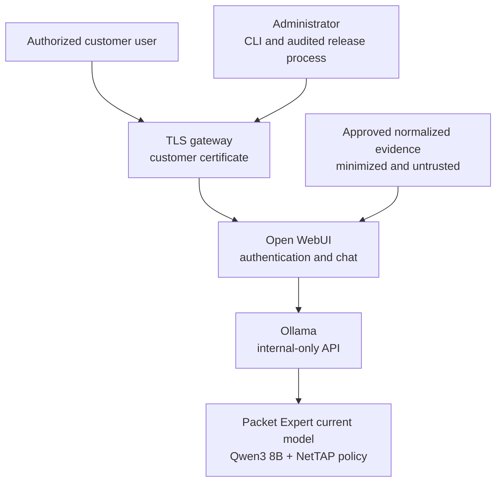

# NetTAP Packet Expert

**Packet analysis and troubleshooting for the NetTAP Engineering Intelligence Suite**

NetTAP Packet Expert is the packet analysis and troubleshooting component of
the **NetTAP Engineering Intelligence Suite**. It runs through **NetTAP Private
AI**, the secure deployment platform, as a customer-isolated network and
security operations assistant. It combines a Qwen3 8B model, a
version-controlled NetTAP operating policy, Ollama, Open WebUI, and an optional
TLS gateway.

The repository builds a custom Ollama model definition; it does **not** contain separately fine-tuned weights. First initialization downloads `qwen3:8b` and creates `nettap-packet-expert:latest`.

The repository, CLI, image, and model coordinates keep the stable
`nettap-packet-expert` identifier for compatible upgrades. The Open WebUI model
definition now uses the product-aligned filename
`openwebui/models/nettap-packet-expert.json`; its stable database ID remains
`nettap-pcap-expert` so existing deployments are updated rather than duplicated.

## Product status

`0.3.0-rc.1` is a valid production candidate for controlled, non-production qualification of the documented single-node architecture. It is not a production-ready, generally available, or certified appliance. Source, Compose, runtime-identity, recovery, release-provenance, and fail-closed certification controls are included. Customer production use and commercial release remain blocked until the exact build has passing macOS and Windows runtime evidence, SBOM/CVE acceptance, independent penetration-test approval, legal/licensing approval, support readiness, signature verification, and authorized release acceptance. See [validation status](docs/VALIDATION_STATUS.md).

## What the product does

- Guides authorized network-performance, availability, visibility, and forensic investigations.
- Separates observed evidence from hypotheses and unavailable information.
- Resists instructions embedded in uploaded or retrieved evidence.
- Requires human review for production changes and supplies validation and rollback guidance.
- Provides local evaluation and hardened single-node customer deployment profiles.
- Supplies administration, health, image-locking, security-scan, backup, restore, packaging, and verification commands.

It is not a packet capture engine, NPB, SIEM, IDS/IPS, NDR, case-management platform, or autonomous network controller. It does not see live traffic, decode arbitrary PCAP files, or connect to NetTAP equipment unless a separately engineered, authorized, and validated integration supplies normalized evidence.

## Architecture



Runtime model traffic is confined to an internal Docker network. Open WebUI has no production host port; the TLS gateway is the only browser entry point. Registry egress is attached only during explicit image/model initialization and removed before runtime. Each customer requires a separate instance because Open WebUI administrators are root-equivalent within an instance.

## Profiles

| Profile | Intended use | Exposure | Required controls |
|---|---|---|---|
| Local | Evaluation and administrator activation | `127.0.0.1:3001` | Generated secret and unique bootstrap password |
| Production | Single-customer deployment | TLS gateway on `8443` by default | Customer certificate, retired bootstrap, immutable image digests, preflight, scan, backup, verification |

Minimum production allocation is 8 CPUs, 16 GiB Docker memory, and 40 GiB free disk. More CPU and 24–32 GiB RAM improve concurrent use. The supplied container profile is CPU-compatible; it does not claim Apple Metal or Windows GPU acceleration.

## Local deployment

### macOS

```bash
git clone https://github.com/mpdwyer2367/nettap-packet-expert.git
cd nettap-packet-expert
chmod +x scripts/* tests/*.sh
./scripts/start-macos.sh
```

Open <http://127.0.0.1:3001>. The script prints the path to a protected local credential file. Sign in as `admin@nettap.local` with that generated password, replace it in **Settings > Account**, verify the generated password no longer works, then run:

```bash
./scripts/finalize-admin.sh --confirm
./scripts/install-openwebui-bundle.sh
```

There is no shared or committed default password.

### Windows

Run Docker Desktop with WSL 2 and Linux containers:

```powershell
git clone https://github.com/mpdwyer2367/nettap-packet-expert.git
Set-Location .\nettap-packet-expert
.\scripts\start-windows.ps1
```

The PowerShell entry point uses the same generated-credential and temporary-egress design. Complete administrator finalization and run `./scripts/install-openwebui-bundle.sh` from WSL or Git Bash. See [Windows deployment](docs/WINDOWS_DEPLOYMENT.md).

## Production deployment

Use a customer-approved DNS name and PEM certificate/private key. Keep keys outside Git.

```bash
./scripts/lock-images.sh --confirm
./scripts/security-scan.sh
./scripts/configure-production.sh \
  --hostname packet-expert.customer.example \
  --certificate /secure/path/tls.crt \
  --private-key /secure/path/tls.key
./scripts/production-preflight.sh
./scripts/start-production.sh
./scripts/verify-production-deployment.sh
```

If administrator activation is incomplete, production startup deliberately opens only the loopback activation profile and refuses to enable the network gateway.

Use [the customer deployment guide](docs/CUSTOMER_DEPLOYMENT_GUIDE.md) for firewall, DNS, backup, acceptance, and rollback requirements.

## Administration

```bash
./scripts/nettap-packet-expert help
./scripts/nettap-packet-expert status
./scripts/nettap-packet-expert health
./scripts/nettap-packet-expert backup --confirm-stop
./scripts/nettap-packet-expert scan
./scripts/nettap-packet-expert stop
```

Restore is non-destructive: it verifies checksums, requires the matching software release, and writes only to new, explicitly named volumes.

```bash
./scripts/backup.sh /secure/backup/path --confirm-stop
./scripts/restore.sh /secure/backup/path --target-prefix customer-test-restore
```

## Knowledge and model behavior

The Ollama behavior and exact current inference parameters are in [the Modelfile](model/Modelfile). The application-level prompt, capability policy, tags, and suggestions are in [`openwebui/models/nettap-packet-expert.json`](openwebui/models/nettap-packet-expert.json). The shared NetTAP chat and suggestion-card theme is mounted from `openwebui/static/`. The Packet Expert skill and its checksum are in `openwebui/skills/`. The source deployment has no custom Open WebUI tools or legacy functions; that inventory is recorded in `openwebui/settings/extensions.json`.

Supplemental administrator-managed knowledge is in [the knowledge file](knowledge/NetTAP_Packet_Expert_Knowledge.md), with its expected checksum in `knowledge/manifest.json`. Import the Markdown file under **Workspace > Knowledge**, restrict its access, and attach it to the Packet Expert model. Updating Git does not automatically replace an imported Open WebUI knowledge revision. Confidential internal and customer knowledge is intentionally excluded from this public repository.

Six expertise-specific first-use prompts are supplied:

- Analyze Packet Capture
- Diagnose TCP Performance
- Validate Capture Quality
- Investigate Suspicious Host
- Audit DNS and TLS
- Hunt C2 and Exfiltration

The complete settings, tool, model, skill, and knowledge operating procedure is in the [operations manual](docs/COMPLETE_OPERATIONS_MANUAL.md).

## Validation and commercial release

```bash
python3 -m pip install -r requirements-validation.txt
./tests/static-checks.sh
./tests/model-behavior-eval.sh
./scripts/certify-production.sh
```

The certification command is fail-closed. It cannot manufacture external evidence and will return `NOT CERTIFIED` until all named approvals and platform reports exist. A signed release package also requires an authorized Cosign key:

```bash
COSIGN_KEY=/secure/release.key ./scripts/package-release.sh
./scripts/verify-release.sh dist/nettap-packet-expert-0.3.0-rc.1-source.tar.gz /path/to/cosign.pub
```

Packaging records the source commit, Git tree, artifact digest and release version in a separately signed provenance record. A checksum-only result is suitable for integrity testing, not commercial release acceptance.

Detailed gates are in [commercial release gates](docs/COMMERCIAL_RELEASE_GATES.md), [threat model](docs/THREAT_MODEL.md), [product roadmap](docs/PRODUCT_ROADMAP.md), the reusable [acceptance template](reports/RELEASE_ACCEPTANCE_TEMPLATE.md), and the completed [0.3.0-rc.1 evidence record](reports/RELEASE_ACCEPTANCE_0.3.0-rc.1.md).

## Security and support boundary

- Never commit `.env`, TLS private keys, bootstrap credentials, customer evidence, backups, or private reports.
- Keep one isolated instance per customer or security boundary.
- Use customer-controlled TLS, host-disk encryption, firewall restrictions, protected backups, retention rules, and centralized monitoring.
- Treat Packet Expert output as advisory. An authorized human approves operational changes and forensic conclusions.
- Report vulnerabilities through a private GitHub security advisory as described in [SECURITY.md](SECURITY.md).

## License

NetTAP-authored source, configuration, and documentation are licensed under the [Apache License 2.0](LICENSE), copyright 2026 NetTAP Technology Limited. That license does not relicense container images, base-model artifacts, or other dependencies and does not grant trademark rights. Review [third-party notices](THIRD_PARTY_NOTICES.md) before distribution.
