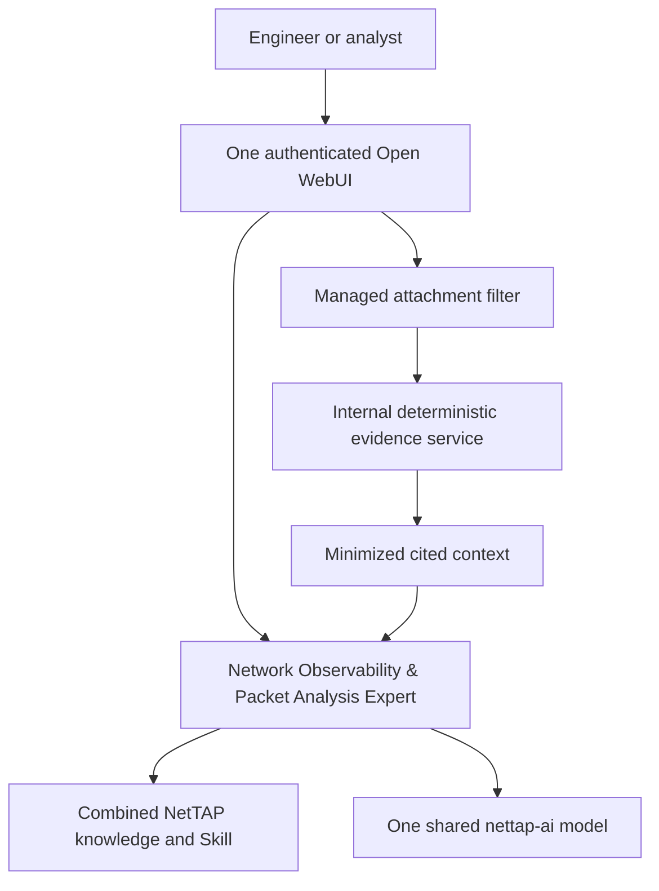

# NetTAP Network Observability & Packet Analysis

NetTAP Network Observability & Packet Analysis is a private, locally hosted operations assistant for network engineering, network troubleshooting, security operations and packet-derived forensic analysis.

Release candidate `0.3.0-rc.7` replaces the earlier multi-page RC6 design with one authenticated Open WebUI experience at `http://127.0.0.1:3100`. The public launcher pages and Evidence Workspace on ports 3000, 3001 and 3200 have been removed.

## One product workflow



The same assistant can:

- design or improve network visibility and monitoring architecture;
- plan TAP, bypass TAP, SPAN, NPB and telemetry acquisition;
- troubleshoot availability, connectivity, latency and loss;
- ingest supported packet captures, logs and normalized flow records from the chat attachment control;
- assess capture quality, provenance and collection gaps;
- develop evidence-supported security and forensic hypotheses;
- provide reviewable implementation, validation and rollback guidance.

## Evidence boundary

Attached `.pcap`, `.json`, `.jsonl`, `.ndjson`, `.log` and `.txt` files are intercepted by a reviewed Open WebUI Filter. The Filter sends the file over the private Docker backend to the deterministic evidence service. The service validates, hashes, parses and analyzes it, retains original evidence in its dedicated volume and returns minimized context. Raw packet payloads, credentials and decryption secrets are not placed in the model prompt.

Classic PCAP with Ethernet or raw-IP link types is supported. PCAPNG and native binary IPFIX/NetFlow/sFlow are not silently guessed; normalize those sources with an approved external process before ingestion. The built-in service does not decrypt payloads, execute malware, query threat-intelligence services or claim live monitoring.

## Components

| Component | Purpose | User access |
|---|---|---|
| Open WebUI | Authentication, chat, attachments, history and administration | `127.0.0.1:3100` locally |
| Managed assistant | Combined observability, packet, network and security workflow | Selected and pinned automatically |
| `nettap-ai:0.3.0-rc.7` | One custom model manifest over the approved Qwen2.5 7B base blobs | Internal Ollama service |
| Managed Filter | Routes supported chat attachments to deterministic ingestion | Transparent inside chat |
| Evidence service | Parsing, hashes, provenance, normalized observations and deterministic findings | Internal Docker network only |
| Offline RAG | Combined NetTAP shared, visibility and packet-analysis knowledge | Attached automatically |

The repository contains the model definition, prompts, Skill, reviewed knowledge, Filter source, evidence service, provisioning logic, deployment scripts and tests. It does not contain separately fine-tuned weights, customer traffic, credentials, captures or a live NetTAP appliance connector.

## macOS installation

Requirements: macOS on Apple Silicon or Intel, Docker Desktop with Compose v2, at least 16 GB RAM recommended and 15 GiB free disk.

```bash
git clone https://github.com/mpdwyer2367/nettap-packet-expert.git
cd nettap-packet-expert
./scripts/nettap-ai start-local
```

Open <http://127.0.0.1:3100>. Sign in as `admin@nettap.local` with the unique value stored in `.bootstrap-admin-password`, change it immediately, verify the bootstrap value fails and run:

```bash
./scripts/finalize-admin.sh --confirm
```

There is no shared `admin/admin` production credential. Existing Open WebUI volumes retain their existing password.

## Windows installation

Install Docker Desktop with WSL2 integration, clone the same Git commit inside WSL2, and run:

```bash
./scripts/nettap-ai start-wsl2
```

Then open <http://127.0.0.1:3100>. See [Windows deployment](docs/WINDOWS_DEPLOYMENT.md).

## Using the assistant

Start with a plain-language objective. Examples:

- Help me understand this network problem.
- Improve network observability for this environment.
- Troubleshoot packet loss or latency.
- Analyze the packet capture I attached.
- Review these logs or flow records for security concerns.
- I am not sure where to start.

For evidence analysis, attach a supported file to the chat and describe the goal. The assistant must identify the data state, evidence quality, supported observations, findings, hypotheses, limitations and prioritized next steps. Evidence-dependent claims should cite evidence identifiers from the minimized analysis.

## Administration

```bash
./scripts/nettap-ai status
./scripts/nettap-ai health
./scripts/nettap-ai repair-local
./scripts/nettap-ai provision-assistants --confirm
./scripts/nettap-ai recover-admin --confirm
./scripts/nettap-ai backup /secure/backup/path --confirm-stop
./scripts/nettap-ai update-models --confirm
./scripts/nettap-ai retire-old-models --confirm
./scripts/nettap-ai stop
```

Never commit `.env`, `.bootstrap-admin-password`, `.evidence-api-token`, TLS private keys, customer evidence, backups or model weights.

## Security posture

- Ollama and the evidence service are not published to the host.
- Local Open WebUI binds to `127.0.0.1` only.
- Normal runtime is offline after controlled initialization.
- Signup, code execution, web search, user webhooks, API keys and unreviewed plugin installation remain disabled.
- The managed Filter is pinned by source checksum and provisioned only by an authenticated administrator.
- Network configuration remains advisory and requires authorized human review, validation and rollback.

## Validation status

Source-level unit and configuration tests can validate parsers, minimization, provisioning behavior and Compose policy. This candidate is not production-certified until the exact Git commit and package pass clean macOS and Windows/WSL2 runtime acceptance, attachment ingestion with representative PCAP/log/flow files, restart, backup, restore, rollback, SBOM/CVE policy, penetration-test disposition, signed-artifact verification and authorized commercial release gates.

See [architecture](docs/ARCHITECTURE.md), [administrator guide](docs/ADMINISTRATION.md), [authentication](docs/AUTHENTICATION.md), [evidence ingestion](docs/EVIDENCE_CASE_SERVICE.md), [macOS deployment](docs/MACOS_DEPLOYMENT.md), [Windows deployment](docs/WINDOWS_DEPLOYMENT.md), [RC7 acceptance](docs/RC7_ACCEPTANCE_PLAN.md) and [commercial release gates](docs/COMMERCIAL_RELEASE_GATES.md).

Licensed under Apache License 2.0. Copyright NetTAP Technology Limited.
