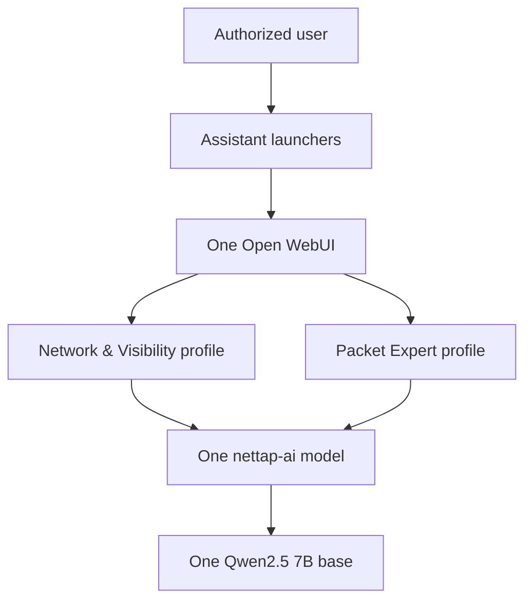

# NetTAP AI Suite

NetTAP AI Suite is a customer-isolated network engineering and security operations assistant package. It runs one combined NetTAP AI model with two specialized user experiences:

- **NetTAP Network & Visibility** for architecture, device planning, TAP/SPAN/NPB deployment, telemetry acquisition, and visibility operations.
- **NetTAP Packet Expert** for authorized packet evidence, capture planning, performance investigation, cyber visibility, and forensic analysis.

The two experiences select the same `nettap-ai:0.3.0-rc.3` Ollama model, which is built once from `qwen2.5:7b-instruct-q4_K_M`. Thin Open WebUI Workspace Model profiles retain separate names, specialist knowledge, suggested starting points, and future tool allowlists without duplicating model weights. The raw NetTAP AI model also supports unified cross-domain workflows. One Open WebUI instance provides one account, chat history, administration, audit, backup, and update surface.

The repository contains model definitions and deployment source. It does **not** contain separately fine-tuned weights, customer telemetry, packet captures, credentials, or a live NetTAP connector.

## Release status

`0.3.0-rc.3` is a migration and integration release candidate. Its source must pass static validation before publication, but it is not production-certified or approved for commercial appliance distribution until the exact commit has passing macOS and Windows runtime evidence, profile-isolation tests, storage measurement, SBOM/CVE acceptance, independent penetration testing, legal/licensing approval, support readiness, signature verification, and authorized release acceptance.

The completed `0.2.0-rc.1` Packet Expert evidence record remains historical evidence for that earlier single-assistant candidate. It does not certify the new suite candidate. See [validation status](docs/VALIDATION_STATUS.md).

## Architecture



The local launchers are stateless pages. Each selects its automatically managed Open WebUI Workspace Model through documented `model` and `q` URL parameters. Both Workspace Models use the same combined Ollama model, while retaining separate prompts, suggestions, and specialist knowledge bindings. Accounts, chats, model weights, and administration remain shared.

Read [the architecture](docs/ARCHITECTURE.md), [migration procedure](docs/MIGRATION.md), and [assistant customization guide](docs/ASSISTANT_CUSTOMIZATION.md) before upgrading an existing deployment.

## Local addresses

| Address | Purpose |
|---|---|
| <http://127.0.0.1:3000> | Network & Visibility starting page |
| <http://127.0.0.1:3001> | Packet Expert starting page |
| <http://127.0.0.1:3100> | Shared Open WebUI and model selector |

The two launchers do not run separate Open WebUI databases or duplicate model weights.

## Requirements

- Docker Desktop and Docker Compose v2
- macOS on Apple Silicon or Intel, or Windows with WSL 2 and Linux containers
- At least 15 GiB free disk for local evaluation
- Recommended local allocation: 8 CPUs and 16 GiB Docker memory
- More memory improves context length and concurrent use

The supplied containerized Ollama profile is CPU-compatible. It does not claim Apple Metal or Windows GPU acceleration.

## New installation

### macOS

```bash
git clone https://github.com/mpdwyer2367/nettap-packet-expert.git
cd nettap-packet-expert
chmod +x scripts/* tests/*.sh
./scripts/start-macos.sh
```

### Windows PowerShell

Run Docker Desktop with WSL 2 and Linux containers:

```powershell
git clone https://github.com/mpdwyer2367/nettap-packet-expert.git
Set-Location .\nettap-packet-expert
.\scripts\start-windows.ps1
```

Startup uses temporary registry egress to retrieve the verified base model, pinned Open WebUI image, and the exact offline embedding-model revision. It then removes registry egress, starts Open WebUI in offline mode, creates three managed knowledge collections, proves retrieval using a deterministic marker, creates both managed Workspace Models, and only then starts the launcher pages. Any failed identity, cache, ingestion, retrieval, or profile check stops installation.

The startup script also generates a unique bootstrap password and prints the protected local file containing it. Sign in as `admin@nettap.local`, change the password immediately, verify the generated password no longer works, and complete administrator finalization. There is no shared or committed default password.

A populated Open WebUI volume retains its existing accounts and passwords; startup does not reset them.

## Upgrade from Packet Expert 0.2

Do not begin by deleting containers or volumes. Follow [MIGRATION.md](docs/MIGRATION.md) to:

1. Inventory and back up the old deployment while using the old release.
2. Protect the old `.env` and record its source commit.
3. Apply the reviewed suite candidate.
4. Build one combined NetTAP AI model from the verified base.
5. Preserve existing Open WebUI accounts, chats, and Packet Expert knowledge.
6. Add the isolated Network & Visibility knowledge collection.
7. Validate both experience profiles, the combined model, launchers, storage, backup, restore, and rollback.

Never merge Open WebUI SQLite files or mount one SQLite volume into multiple running Open WebUI containers.

## Administration

```bash
./scripts/nettap-ai help
./scripts/nettap-ai status
./scripts/nettap-ai health
./scripts/nettap-ai update-models --confirm
./scripts/nettap-ai provision-assistants --confirm
./scripts/nettap-ai backup /secure/backup/path --confirm-stop
./scripts/nettap-ai stop
```

The old `scripts/nettap-packet-expert` entry point remains as a compatibility wrapper for the 0.3 migration. See [administration](docs/ADMINISTRATION.md), [backup and restore](docs/COMPLETE_OPERATIONS_MANUAL.md), and [authentication](docs/AUTHENTICATION.md).

## Knowledge and customizations

| Experience | Runtime model policy | Knowledge source |
|---|---|---|
| Unified NetTAP AI | [nettap-ai.Modelfile](model/nettap-ai.Modelfile) | [Shared NetTAP AI knowledge](knowledge/NetTAP_AI_Knowledge.md) |
| Network & Visibility profile | Same `nettap-ai` model | [NetTAP Network & Visibility knowledge](knowledge/NetTAP_Network_Visibility_Knowledge.md) |
| Packet Expert profile | Same `nettap-ai` model | [NetTAP Packet Expert knowledge](knowledge/NetTAP_Packet_Expert_Knowledge.md) |

The [ingestion and analysis guidance](knowledge/NetTAP_Ingestion_Analysis_Guidance.md) is shared by both profiles. It defines accurate handling for PCAP-derived evidence, logs, flow telemetry, cloud flow records, decryption, provenance, correlation, and evidence-bounded security conclusions.

Critical evidence and safety rules are built into the combined Ollama model definition. RC3 reconciles reviewed Git sources into restricted managed Open WebUI collections through supported application APIs; it never writes Open WebUI database tables directly. Shared knowledge is attached to both profiles and each specialist collection only to its matching profile. Source changes produce a new provisioning fingerprint and require a successful administrator-authenticated reconciliation before the launchers are enabled.

See [assistant customization](docs/ASSISTANT_CUSTOMIZATION.md), [knowledge management](docs/KNOWLEDGE_MANAGEMENT.md), and [tool security](docs/TOOL_SECURITY.md).

## Validation

Source validation:

```bash
./tests/static-checks.sh
```

Runtime validation after deployment:

```bash
./tests/model-behavior-eval.sh
./tests/normalized-ingestion-eval.sh
./tests/model-storage-sharing.sh
./tests/backup-restore-e2e.sh
./tests/failed-update-rollback-e2e.sh
```

On a supported macOS host:

```bash
./tests/macos-e2e.sh
```

Release acceptance must start from the signed source package rather than a working checkout. Run the following command once on macOS and once inside Windows/WSL2, using the same archive, checksum, provenance, signatures, and public key:

```bash
./tests/clean-package-acceptance.sh \
  --archive /approved/nettap-ai-suite-0.3.0-rc.3-source.tar.gz \
  --evidence-dir /protected/nettap-rc3-acceptance \
  --public-key /approved/cosign.pub
```

The clean-package test creates an isolated Compose project with empty volumes, verifies the package against its exact Git tree and signature, installs the candidate, requires administrator password replacement, verifies ports 3000/3001/3100, exercises automatic offline RAG and both assistants, executes all fourteen behavior cases plus normalized packet/log/IPFIX examples, measures shared model storage, and tests restart, backup/restore, failed-update recovery, SBOM, and the vulnerability policy. Compare the two resulting summaries with `./tests/compare-platform-acceptance.sh`. See [the RC3 acceptance plan](docs/RC3_ACCEPTANCE_PLAN.md).

The tests verify model identity, provisioning API behavior and idempotence, exact embedding revision metadata, offline retrieval proof, managed profile selection, combined capabilities, evidence boundaries, shared runtime, and recovery controls. They do not prove factual accuracy for every prompt or replace target-host, independent security, and customer acceptance.

## Production profile

Use a customer-approved DNS name and certificate:

```bash
./scripts/lock-images.sh --confirm
./scripts/security-scan.sh
./scripts/configure-production.sh \
  --hostname nettap-ai.customer.example \
  --certificate /secure/path/tls.crt \
  --private-key /secure/path/tls.key
./scripts/production-preflight.sh
./scripts/start-production.sh
./scripts/verify-production-deployment.sh
```

Production assistant links are:

- `https://nettap-ai.customer.example:8443/visibility`
- `https://nettap-ai.customer.example:8443/packet-expert`

The TLS gateway is the only production browser entry point. Ollama and Open WebUI have no direct production host ports. Each customer or security boundary requires a separate instance.

## Product boundaries

- No live traffic or telemetry is available unless a separately approved connector supplies current evidence.
- The LLM is not an NPB, capture engine, flow collector, SIEM, IDS/IPS, NDR, case-management platform, or autonomous controller.
- Configuration and forensic conclusions require authorized human review.
- Tools are disabled by default and require a separate security and release decision.
- Never commit `.env`, TLS private keys, bootstrap credentials, customer evidence, backups, private reports, or model weights.

## Release and license

The certification command is fail-closed and cannot manufacture external evidence:

```bash
./scripts/certify-production.sh
COSIGN_KEY=/secure/release.key ./scripts/package-release.sh
./scripts/verify-release.sh dist/nettap-ai-suite-0.3.0-rc.3-source.tar.gz /path/to/cosign.pub
```

NetTAP-authored source, configuration, and documentation are licensed under the [Apache License 2.0](LICENSE), copyright 2026 NetTAP Technology Limited. The license does not relicense container images, base-model artifacts, or other dependencies and does not grant trademark rights. Review [third-party notices](THIRD_PARTY_NOTICES.md) before distribution.
