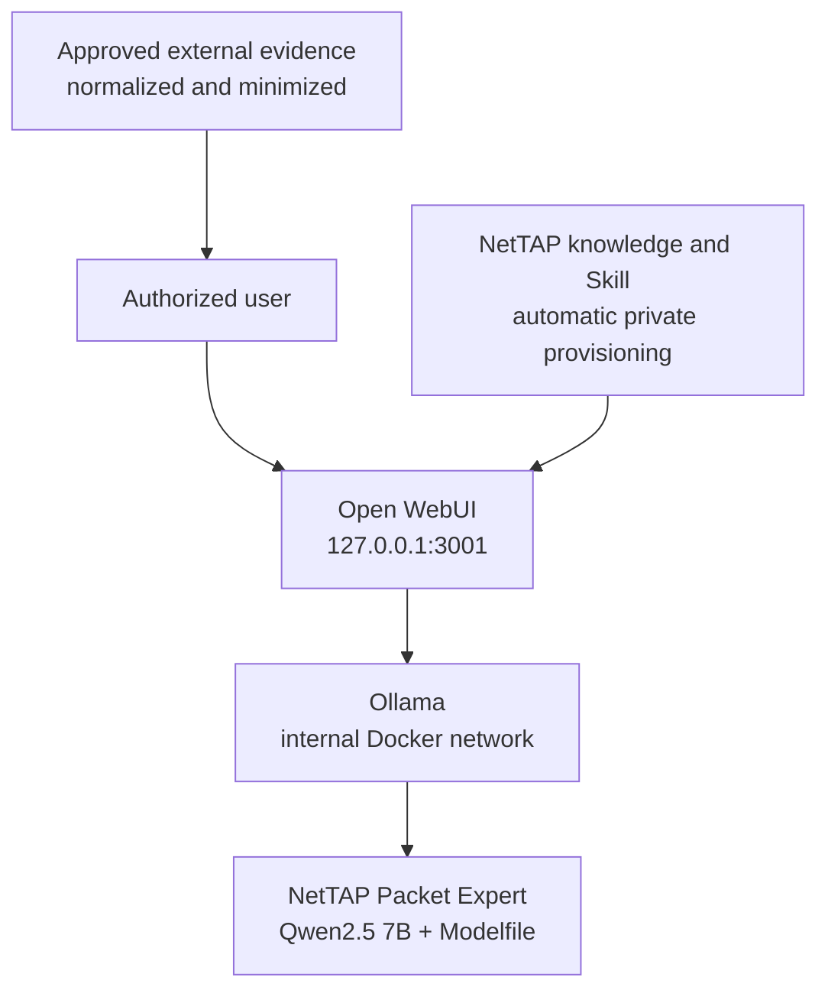

# NetTAP Packet Expert

NetTAP Packet Expert is a local network operations and security operations assistant. The release-candidate deployment combines a Qwen2.5 7B instruction model, a versioned NetTAP operating prompt, Ollama, and Open WebUI.

This repository deploys a custom Ollama model definition, not fine-tuned model weights. On first deployment, Ollama downloads `qwen2.5:7b-instruct-q4_K_M` and builds `nettap-packet-expert:0.1.0-rc.7` from [`model/Modelfile`](model/Modelfile).

## What is included

- Evidence-disciplined guidance for authorized network-performance, availability, cyber-visibility, and forensic investigations.
- A local Ollama model and loopback-only Open WebUI chat interface.
- Four broad starter prompts for users who do not know where to begin.
- Supplemental project knowledge in [`knowledge/NetTAP_Packet_Expert_Knowledge.md`](knowledge/NetTAP_Packet_Expert_Knowledge.md).
- macOS deployment scripts, source checks, and a macOS runtime acceptance harness.
- A Docker Compose path that can also be run from Windows with Docker Desktop and Linux containers.

## Important capability boundary

Packet Expert does **not** capture interfaces, decode a binary PCAP by itself, observe live traffic, connect automatically to a NetTAP NPB, replace Wireshark/TShark, or operate network and security controls. A NetTAP TAP/NPB or another authorized source must deliver evidence to an approved capture and normalization workflow. Supply only minimized, authorized evidence to the model.

The assistant must distinguish supplied evidence, retrieved documentation, general knowledge, hypotheses, and unavailable information. It must not claim that live traffic, a capture, a telemetry feed, or a tool result exists unless the application actually provides it.

## Architecture



Open WebUI and Ollama communicate on an internal Docker network. The browser is bound to host loopback by default. Ollama is not published on a host port.

## What loads automatically

| Component | Deployment behavior | Source |
|---|---|---|
| Base model | Downloaded on the first model initialization | Ollama registry |
| NetTAP model behavior | Built into the custom Ollama model | `model/Modelfile` |
| Starter prompts | Seeded on a fresh Open WebUI data volume | `compose.yaml` |
| Open WebUI accounts and chats | Persisted in a Docker volume | Open WebUI data volume |
| NetTAP knowledge file | Automatically indexed and attached after first-admin creation | `knowledge/NetTAP_Packet_Expert_Knowledge.md` |
| Formal Open WebUI Skill | Automatically installed and attached after first-admin creation | `workspace/skills/nettap-packet-evidence-analysis.md` |
| Formal Open WebUI Workspace Skills | **No separate Skill package is included in RC7** | Operational instructions are in the Modelfile |
| Live packet or telemetry feeds | **Not included** | Requires a separately engineered and authorized integration |

The Ollama Modelfile supplies always-on safety boundaries. Open WebUI also receives a formal, versioned Packet Evidence Analysis Skill that is attached to the workspace model.

## Requirements

| Host | Supported evaluation path | Minimum guidance |
|---|---|---|
| macOS | Apple silicon (`arm64`) or Intel (`x86_64`), Docker Desktop, Compose v2 | 16 GB RAM recommended; 15 GB free disk |
| Windows | Windows 11 or supported Windows 10, hardware virtualization, WSL 2, Docker Desktop using Linux containers, Git | 16 GB RAM recommended; 15 GB free disk |

The first run downloads multiple container images and an approximately 4.7 GB quantized base model. Download time depends on the network and storage.

The default container profile is CPU-compatible. Docker Desktop does not expose Apple Metal acceleration to the Linux Ollama container, and this Compose file does not request a Windows GPU. Do not advertise GPU acceleration for this profile.

## Deploy on macOS

1. Install and start Docker Desktop.
2. Open Terminal and run:

```bash
git clone https://github.com/mpdwyer2367/nettap-packet-expert.git
cd nettap-packet-expert
chmod +x scripts/*.sh tests/*.sh
./scripts/start-macos.sh
```

The script validates the Docker runtime and disk space, creates a protected `.env`, generates the Open WebUI secret, pulls the pinned containers and base model, builds the NetTAP model, and starts Open WebUI.

Open <http://127.0.0.1:3001> after the script completes.

## Deploy on Windows

Use PowerShell from a normal user account. Docker Desktop must be running with the WSL 2 engine and Linux containers.

```powershell
git clone https://github.com/mpdwyer2367/nettap-packet-expert.git
Set-Location .\nettap-packet-expert
powershell -ExecutionPolicy Bypass -File .\scripts\Start-Windows.ps1
```

Open <http://127.0.0.1:3001>. If a command fails, stop and review the reported error; do not skip model initialization.

## Complete first administrator setup

1. Open <http://127.0.0.1:3001> from the same host.
2. Create the first account. Open WebUI assigns the first account the administrator role. Later accounts remain pending until an administrator approves them.
3. Use a password with 12–72 characters containing uppercase, lowercase, number, and symbol.
4. Confirm that `nettap-packet-expert:0.1.0-rc.7` is selected.
5. Verify the four starter prompts:
   - Start an investigation
   - Understand my evidence
   - Troubleshoot a network problem
   - Help me decide
6. Send: `I am not sure where to start with a suspected network problem. Ask one important question and do not claim you have live data.`
7. Confirm that the answer asks one bounded question and does not claim access to traffic or telemetry.

Starter prompts are persistent Open WebUI configuration. A fresh Open WebUI data volume receives the repository defaults. An existing volume can retain older prompts; review and update them in the Open WebUI administrator settings instead of deleting the volume and losing user data.

## Automated Open WebUI workspace provisioning

The `workspace-init` service waits for the first administrator account, then idempotently:

1. Creates or updates the private `NetTAP Packet Expert` knowledge base.
2. Uploads and indexes the versioned knowledge Markdown when its hash changes.
3. Creates or updates the formal `NetTAP Packet Evidence Analysis` Skill.
4. Creates or updates the `NetTAP Packet Expert` workspace model and attaches both resources.
5. Queries the vector index and fails if expected evidence-quality guidance is not retrieved.

Open WebUI supports focused retrieval and full-context attachment. Focused retrieval is the safer default as the knowledge base grows. The current short project file can also use full context if administrators want it present in every request and have confirmed the context-window impact.

Resources remain private to the first administrator by default. An administrator may deliberately grant approved users read access in Open WebUI. Rerunning `workspace-init` updates changed content without duplicating records.

## Packaged operating skills

The custom model automatically receives these behaviors from the Modelfile:

- Begin with the symptom, operational decision, or investigation objective.
- Ask one important question at a time and offer a “Help me decide” path.
- Move from the goal to the affected endpoint or service, time window, authorized observation point, evidence, and next bounded check.
- Separate observations from hypotheses and state what evidence would resolve uncertainty.
- Validate authorization, capture position, direction, filter, snap length, retention, privacy, timestamps, dropped packets, truncation, VLANs, and tunnels where relevant.
- Request vendor, model, OS version, interfaces, addressing, VLANs, and intended outcome before vendor-specific configuration.
- Never invent commands, interface names, supported features, counters, packet contents, or completed actions.
- Present configuration as reviewable steps with validation and rollback.

The formal Skill is packaged at [`workspace/skills/nettap-packet-evidence-analysis.md`](workspace/skills/nettap-packet-evidence-analysis.md). Skills are instructions, not executable integrations or live-data access.

## Validate the deployment

### macOS automated acceptance

```bash
./tests/macos-e2e.sh
```

The harness checks source controls, model creation, identity, controlled inference, UI health, and persistence across service restart. It writes a timestamped report under `reports/`. Complete the manual administrator, prompt, model-selection, chat, and sign-in checks printed by the harness.

After creating the first administrator, validate actual indexed retrieval and attachments with:

```bash
./tests/retrieval-e2e.sh
```

### Windows acceptance

From the repository PowerShell window used for deployment:

```powershell
powershell -ExecutionPolicy Bypass -File .\tests\Windows-E2E.ps1
```

Expected results: both long-running services are healthy/running, `ollama show` identifies the NetTAP system prompt, inference returns non-empty output, and the health request returns success. Then complete the same manual browser checks listed above.

The Windows harness automates source checks, model identity, inference, WebUI health, loopback binding, and restart persistence. Do not claim Windows runtime validation until it passes on each advertised Windows/Docker Desktop configuration and the manual checks are recorded.

## Daily operations

### macOS

```bash
./scripts/status.sh
./scripts/stop.sh
./scripts/update-model.sh --confirm
```

`stop.sh` preserves persistent data. `update-model.sh` pulls the declared base and rebuilds the custom model after a reviewed Modelfile change.

### Windows

```powershell
.\scripts\Status-Windows.ps1
.\scripts\Stop-Windows.ps1
.\scripts\Update-Model-Windows.ps1 -Confirm
```

`docker compose down` preserves named volumes. Never add `-v` unless permanent deletion of all local accounts, chats, configuration, knowledge, and downloaded models is intended. Back up the Open WebUI and Ollama named volumes before upgrades; RC7 does not include an automated backup/restore tool.

## Troubleshooting

- **Docker command not found:** install Docker Desktop and reopen the terminal.
- **Docker engine unavailable:** start Docker Desktop and wait until the engine reports ready.
- **Open WebUI does not open:** run the status and log commands, then confirm that port 3001 is unused and the bind address remains `127.0.0.1`.
- **Model is missing:** rerun the model initialization command and inspect its output. Do not create a similarly named model manually.
- **Old starter prompts remain:** persistent Open WebUI configuration is retaining the old values; update them in administrator settings.
- **Knowledge answers are generic:** confirm the file completed processing and the knowledge base is attached to the selected Open WebUI model/preset.
- **Knowledge cannot be found by another user:** verify that the user has access to the attached knowledge resource.
- **Slow Apple silicon inference:** this containerized profile is CPU-compatible and does not use Metal acceleration.
- **Port 3001 is already used:** change `WEB_PORT` in `.env`, restart, and open the new loopback URL.

## Security and data handling

- Keep `BIND_ADDRESS=127.0.0.1` unless an approved reverse proxy, TLS, firewall, identity, and access-control design is deployed.
- Do not commit `.env`; it contains the Open WebUI secret.
- Authentication and password validation are enabled. Code execution, the code interpreter, and pip installation are disabled in the supplied Compose configuration.
- Keep credentials, personal content, secrets, and unnecessary packet payload outside the model boundary.
- Treat packet captures and forensic evidence as sensitive records subject to authorization, retention, and chain-of-custody requirements.
- Review [`docs/SECURITY.md`](docs/SECURITY.md), [`SECURITY.md`](SECURITY.md), and [`THIRD_PARTY_NOTICES.md`](THIRD_PARTY_NOTICES.md) before broader deployment.

## Release status

`0.1.0-rc.7` is an evaluation release candidate. Source-level validation is available in CI. It must not be called macOS-validated until `tests/macos-e2e.sh` and the manual acceptance checklist pass on the physical Apple silicon and Intel hosts that will be advertised. Windows runtime acceptance is manual in this release.

No license has yet been selected for NetTAP-authored source. Public repository visibility is not the same as an open-source license. Add an approved project license before inviting redistribution or external contributions.

## Official references

- [Open WebUI Knowledge](https://docs.openwebui.com/features/workspace/knowledge/)
- [Open WebUI Skills](https://docs.openwebui.com/features/workspace/skills/)
- [Open WebUI Models](https://docs.openwebui.com/features/workspace/models/)
- [Docker Desktop](https://docs.docker.com/desktop/)
- [Ollama Modelfile reference](https://docs.ollama.com/modelfile)

See [`docs/MACOS_DEPLOYMENT.md`](docs/MACOS_DEPLOYMENT.md) and [`docs/WINDOWS_DEPLOYMENT.md`](docs/WINDOWS_DEPLOYMENT.md) for platform-specific deployment and acceptance details.
