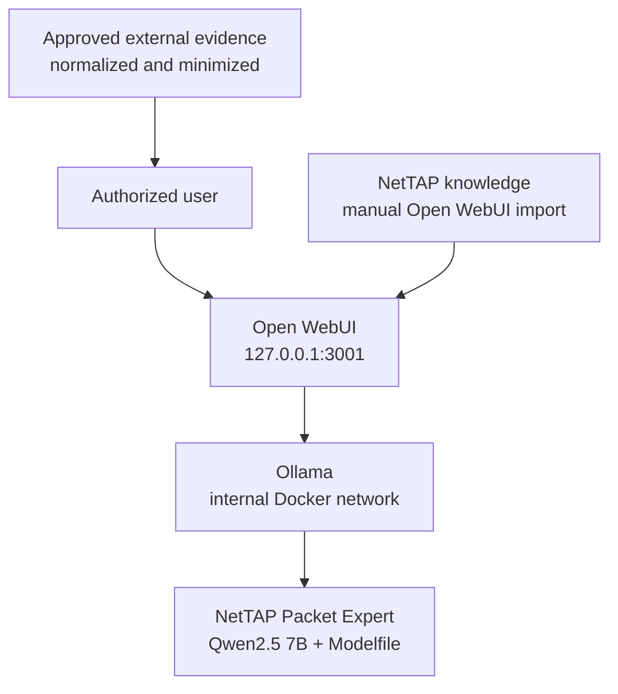

# NetTAP Packet Expert

NetTAP Packet Expert is a local network operations and security operations assistant. The release-candidate deployment combines a Qwen2.5 7B instruction model, a versioned NetTAP operating prompt, Ollama, and Open WebUI.

This repository deploys a custom Ollama model definition, not fine-tuned model weights. On first deployment, Ollama downloads `qwen2.5:7b-instruct-q4_K_M` and builds `nettap-packet-expert:0.1.0-rc.8` from [`model/Modelfile`](model/Modelfile).

## What is included

- Evidence-disciplined guidance for authorized network-performance, availability, cyber-visibility, and forensic investigations.
- A local Ollama model and loopback-only Open WebUI chat interface.
- Four broad starter prompts for users who do not know where to begin.
- Supplemental project knowledge in [`knowledge/NetTAP_Packet_Expert_Knowledge.md`](knowledge/NetTAP_Packet_Expert_Knowledge.md).
- macOS deployment scripts, source checks, and a macOS runtime acceptance harness.
- A Docker Compose path that can also be run from Windows with Docker Desktop and Linux containers.
- A fresh-install administrator bootstrap with a documented secure-password transition.

## Important capability boundary

Packet Expert does **not** capture interfaces, decode a binary PCAP by itself, observe live traffic, connect automatically to a NetTAP NPB, replace Wireshark/TShark, or operate network and security controls. A NetTAP TAP/NPB or another authorized source must deliver evidence to an approved capture and normalization workflow. Supply only minimized, authorized evidence to the model.

The assistant must distinguish supplied evidence, retrieved documentation, general knowledge, hypotheses, and unavailable information. It must not claim that live traffic, a capture, a telemetry feed, or a tool result exists unless the application actually provides it.

## Architecture



Open WebUI and Ollama communicate on an internal Docker network. The browser is bound to host loopback by default. Ollama is not published on a host port.

## What loads automatically

| Component | Deployment behavior | Source |
|---|---|---|
| Base model | Downloaded on the first model initialization | Ollama registry |
| NetTAP model behavior | Built into the custom Ollama model | `model/Modelfile` |
| Starter prompts | Seeded on a fresh Open WebUI data volume | `compose.yaml` |
| Administrator | Created only when the Open WebUI user database is empty | `admin@nettap.local` / temporary password `admin` |
| Open WebUI accounts and chats | Persisted in a Docker volume | Open WebUI data volume |
| NetTAP knowledge file | **Manual import and model attachment required** | `knowledge/NetTAP_Packet_Expert_Knowledge.md` |
| Formal Open WebUI Workspace Skills | **No separate Skill package is included in RC8** | Operational instructions are in the Modelfile |
| Live packet or telemetry feeds | **Not included** | Requires a separately engineered and authorized integration |

In this release, “Packet Expert skills” means the investigation workflow and guardrails encoded in the Modelfile. It is not a claim that an Open WebUI Workspace Skill has been installed. Do not import the same instructions twice unless you intentionally want additional prompt context.

## Requirements

| Host | Supported evaluation path | Minimum guidance |
|---|---|---|
| macOS | Apple silicon (`arm64`) or Intel (`x86_64`), Docker Desktop, Compose v2 | 16 GB RAM recommended; 15 GB free disk |
| Windows | Windows 11 or supported Windows 10, hardware virtualization, WSL 2, Docker Desktop using Linux containers, Git | 16 GB RAM recommended; 15 GB free disk |

The first run downloads multiple container images and an approximately 4.7 GB quantized base model. Download time depends on the network and storage.

The default container profile is CPU-compatible. Docker Desktop does not expose Apple Metal acceleration to the Linux Ollama container, and this Compose file does not request a Windows GPU. Do not advertise GPU acceleration for this profile.

## Fresh-install administrator

A new Open WebUI data volume receives this temporary local account:

- Login: `admin@nettap.local`
- Temporary password: `admin`

Open WebUI requires an email-formatted login, so the identifier is `admin@nettap.local`, not plain `admin`. The account is created only when no Open WebUI users exist. Existing volumes retain their accounts, roles, passwords, chats, and settings.

Additional signup is disabled. Immediately after the first login, open **Settings > Account**, enter `admin` as the current password, and set a unique password containing 12–72 characters with uppercase, lowercase, number, and symbol. Do not change `BIND_ADDRESS` from `127.0.0.1`, configure VirtualBox bridged networking, or expose the UI through a reverse proxy until the temporary password has been replaced.

Open WebUI does not provide a native forced-password-change-on-first-login control. RC8 therefore uses a prominent warning banner and a documented administrator acceptance step; it does not falsely claim technical enforcement.

## Deploy on macOS

1. Install and start Docker Desktop.
2. Open Terminal and run:

```bash
git clone https://github.com/mpdwyer2367/nettap-packet-expert.git
cd nettap-packet-expert
chmod +x scripts/*.sh tests/*.sh
./scripts/start-macos.sh
```

The script validates the Docker runtime and disk space, creates a protected `.env`, generates the Open WebUI secret, pulls the pinned containers and base model, builds the NetTAP model, and starts Open WebUI.

Open <http://127.0.0.1:3001> after the script completes.

## Deploy on Windows

Use PowerShell from a normal user account. Docker Desktop must be running with the WSL 2 engine and Linux containers.

```powershell
git clone https://github.com/mpdwyer2367/nettap-packet-expert.git
Set-Location .\nettap-packet-expert
.\scripts\start-windows.ps1
```

If local policy blocks the script, run this one time from the repository directory:

```powershell
powershell -ExecutionPolicy Bypass -File .\scripts\start-windows.ps1
```

Open <http://127.0.0.1:3001>. If a command fails, stop and review the reported error; do not skip model initialization. See [Windows deployment](docs/WINDOWS_DEPLOYMENT.md).

## Complete first administrator setup

1. Open <http://127.0.0.1:3001> from the same host.
2. Sign in with `admin@nettap.local` and temporary password `admin`.
3. Open **Settings > Account** and change the password to a unique 12–72 character password containing uppercase, lowercase, number, and symbol.
4. Sign out and sign in with the new password. Confirm that the old password no longer works.
5. Confirm that `nettap-packet-expert:0.1.0-rc.8` is selected.
6. Verify the four starter prompts:
   - Start an investigation
   - Understand my evidence
   - Troubleshoot a network problem
   - Help me decide
7. Send: `I am not sure where to start with a suspected network problem. Ask one important question and do not claim you have live data.`
8. Confirm that the answer asks one bounded question and does not claim access to traffic or telemetry.

Starter prompts are persistent Open WebUI configuration. A fresh Open WebUI data volume receives the repository defaults. An existing volume can retain older prompts; review and update them in the Open WebUI administrator settings instead of deleting the volume and losing user data.

## Load the NetTAP knowledge into Open WebUI

The knowledge file is deliberately not auto-imported because Open WebUI knowledge belongs to its persistent application database and access-control model.

1. Sign in as the first administrator.
2. Open **Workspace > Knowledge**.
3. Select **Create** and name the knowledge base `NetTAP Packet Expert`.
4. Upload [`knowledge/NetTAP_Packet_Expert_Knowledge.md`](knowledge/NetTAP_Packet_Expert_Knowledge.md).
5. Wait for processing to complete.
6. Open **Workspace > Models**, edit the NetTAP model or create an Open WebUI model preset based on `nettap-packet-expert:0.1.0-rc.8`, and attach the `NetTAP Packet Expert` knowledge base.
7. Save, start a new chat with that model, and ask: `What evidence-quality checks should I complete before interpreting supplied network evidence?`
8. Confirm the response uses the knowledge guidance and still states that no live capture is connected.

Open WebUI supports focused retrieval and full-context attachment. Focused retrieval is the safer default as the knowledge base grows. The current short project file can also use full context if administrators want it present in every request and have confirmed the context-window impact.

Updating the Markdown file in Git does not update a knowledge base that was already imported. Re-upload the approved revision or use a separately designed knowledge-sync process.

## Packaged operating skills

The custom model automatically receives these behaviors from the Modelfile:

- Begin with the symptom, operational decision, or investigation objective.
- Ask one important question at a time and offer a “Help me decide” path.
- Move from the goal to the affected endpoint or service, time window, authorized observation point, evidence, and next bounded check.
- Separate observations from hypotheses and state what evidence would resolve uncertainty.
- Validate authorization, capture position, direction, filter, snap length, retention, privacy, timestamps, dropped packets, truncation, VLANs, and tunnels where relevant.
- Request vendor, model, OS version, interfaces, addressing, VLANs, and intended outcome before vendor-specific configuration.
- Never invent commands, interface names, supported features, counters, packet contents, or completed actions.
- Present configuration as reviewable steps with validation and rollback.

Open WebUI also has a formal **Workspace > Skills** feature for reusable Markdown instructions. RC8 does not ship a separate importable Skill file; the authoritative Packet Expert instructions are already versioned in the Modelfile. If a future release adds formal Skill files, import them under **Workspace > Skills**, grant users read access, and bind them to the model under **Workspace > Models**. Skills are instructions, not executable integrations or live data access.

## Validate the deployment

### macOS automated acceptance

```bash
./tests/macos-e2e.sh
```

The harness checks source controls, model creation, identity, controlled inference, UI health, and persistence across service restart. It writes a timestamped report under `reports/`. Complete the manual administrator, prompt, model-selection, chat, and sign-in checks printed by the harness.

### Windows acceptance

From the repository PowerShell window used for deployment:

```powershell
$compose = @('compose', '--env-file', '.env', '-f', 'compose.yaml')
docker @compose ps
docker @compose exec -T ollama ollama show nettap-packet-expert:0.1.0-rc.8
docker @compose exec -T ollama ollama run nettap-packet-expert:0.1.0-rc.8 `
  'Ask one important question and do not claim that you have live packet data.'
Invoke-WebRequest http://127.0.0.1:3001/health -UseBasicParsing
```

Expected results: both long-running services are healthy/running, `ollama show` identifies the NetTAP system prompt, inference returns non-empty output, and the health request returns success. Then complete the same manual browser checks listed above.

No Windows automated E2E harness is included in RC8. Do not claim Windows runtime validation until these checks pass on each advertised Windows/Docker Desktop configuration and the results are recorded.

## Daily operations

### macOS

```bash
./scripts/status.sh
./scripts/stop.sh
./scripts/update-model.sh --confirm
```

`stop.sh` preserves persistent data. `update-model.sh` pulls the declared base and rebuilds the custom model after a reviewed Modelfile change.

### Windows

```powershell
$compose = @('compose', '--env-file', '.env', '-f', 'compose.yaml')
docker @compose ps
docker @compose logs --tail 200 ollama open-webui
docker @compose down
docker @compose --profile initialize run --rm model-init
docker @compose up -d open-webui
```

`docker compose down` preserves named volumes. Never add `-v` unless permanent deletion of all local accounts, chats, configuration, knowledge, and downloaded models is intended. Back up the Open WebUI and Ollama named volumes before upgrades; RC8 does not include an automated backup/restore tool.

## Troubleshooting

- **Docker command not found:** install Docker Desktop and reopen the terminal.
- **Docker engine unavailable:** start Docker Desktop and wait until the engine reports ready.
- **Open WebUI does not open:** run the status and log commands, then confirm that port 3001 is unused and the bind address remains `127.0.0.1`.
- **Model is missing:** rerun the model initialization command and inspect its output. Do not create a similarly named model manually.
- **Old starter prompts remain:** persistent Open WebUI configuration is retaining the old values; update them in administrator settings.
- **Knowledge answers are generic:** confirm the file completed processing and the knowledge base is attached to the selected Open WebUI model/preset.
- **Knowledge cannot be found by another user:** verify that the user has access to the attached knowledge resource.
- **Slow Apple silicon inference:** this containerized profile is CPU-compatible and does not use Metal acceleration.
- **Port 3001 is already used:** change `WEB_PORT` in `.env`, restart, and open the new loopback URL.
- **`admin@nettap.local / admin` does not work:** the Open WebUI volume already contains a user. Use the existing administrator or follow the supported password-recovery procedure; bootstrap credentials never overwrite an existing account.

## Security and data handling

- Keep `BIND_ADDRESS=127.0.0.1` unless an approved reverse proxy, TLS, firewall, identity, and access-control design is deployed.
- Do not commit `.env`; it contains the Open WebUI secret.
- Authentication and password validation are enabled. Code execution, the code interpreter, and pip installation are disabled in the supplied Compose configuration.
- The bootstrap password is intentionally temporary. Replace it before expanding access beyond host loopback.
- Keep credentials, personal content, secrets, and unnecessary packet payload outside the model boundary.
- Treat packet captures and forensic evidence as sensitive records subject to authorization, retention, and chain-of-custody requirements.
- Review [`docs/SECURITY.md`](docs/SECURITY.md), [`SECURITY.md`](SECURITY.md), and [`THIRD_PARTY_NOTICES.md`](THIRD_PARTY_NOTICES.md) before broader deployment.

## Release status

`0.1.0-rc.8` is an evaluation release candidate. Source-level validation is available in CI. It must not be called macOS-validated until `tests/macos-e2e.sh` and the manual acceptance checklist pass on the physical Apple silicon and Intel hosts that will be advertised. Windows runtime acceptance is manual in this release.

No license has yet been selected for NetTAP-authored source. Public repository visibility is not the same as an open-source license. Add an approved project license before inviting redistribution or external contributions.

## Official references

- [Open WebUI Knowledge](https://docs.openwebui.com/features/workspace/knowledge/)
- [Open WebUI Skills](https://docs.openwebui.com/features/workspace/skills/)
- [Open WebUI Models](https://docs.openwebui.com/features/workspace/models/)
- [Open WebUI environment configuration](https://docs.openwebui.com/reference/env-configuration/)
- [Docker Desktop](https://docs.docker.com/desktop/)
- [Ollama Modelfile reference](https://docs.ollama.com/modelfile)

For platform-specific detail, see [`docs/MACOS_DEPLOYMENT.md`](docs/MACOS_DEPLOYMENT.md), [`docs/WINDOWS_DEPLOYMENT.md`](docs/WINDOWS_DEPLOYMENT.md), and [`docs/AUTHENTICATION.md`](docs/AUTHENTICATION.md).

For inventory, consolidation, backup, administration, maintenance, sharing, GitHub release management, and operator handoff, use the [`complete operations manual`](docs/COMPLETE_OPERATIONS_MANUAL.md). On macOS, begin duplicate-deployment cleanup with the read-only [`scripts/inventory-macos.sh`](scripts/inventory-macos.sh); review its output before stopping or removing anything.
