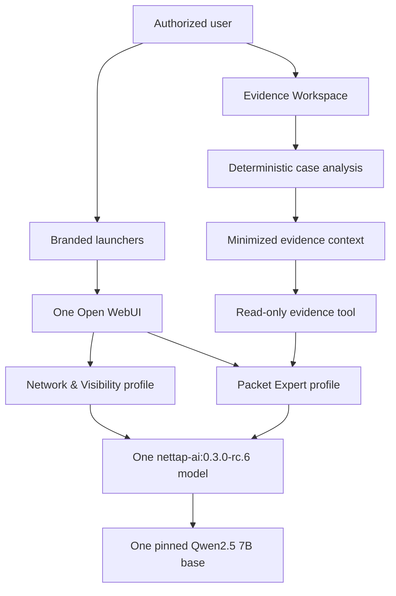

# NetTAP Network Intelligence

NetTAP Network Intelligence is a private, customer-isolated network visibility and forensic operations platform. It runs one shared **NetTAP Network Intelligence Model** with two specialized user experiences:

- **NetTAP Network Intelligence — Network & Visibility** for architecture, device planning, TAP/SPAN/NPB deployment, telemetry acquisition, and visibility operations.
- **NetTAP Network Intelligence — Packet Expert** for authorized packet evidence, capture planning, performance investigation, cyber visibility, and forensic analysis.

The two experiences select the same technical Ollama model tag, `nettap-ai:0.3.0-rc.6`, built once from `qwen2.5:7b-instruct-q4_K_M`. A fresh appliance downloads one Qwen weight set and creates one NetTAP model manifest over those shared blobs. Thin Open WebUI Workspace Model profiles retain separate names, specialist knowledge, suggested starting points, and tool allowlists without downloading or duplicating a second 7B model. The shared model also supports unified cross-domain workflows. One Open WebUI instance provides one account, chat history, administration, audit, backup, and update surface.

The repository contains the combined model definition, both experience Skills, reviewed RAG knowledge, automatic provisioning, and the evaluation **NetTAP Network Intelligence — Evidence Workspace** for uploaded PCAP metadata, normalized logs and flow records. It does **not** contain separately fine-tuned weights, customer telemetry, packet captures, credentials, or a live NetTAP connector. See the [combined model card](model/MODEL_CARD.md), [Evidence Workspace guide](docs/EVIDENCE_CASE_SERVICE.md), and [naming conventions](docs/NAMING_CONVENTIONS.md).

## Release status

`0.3.0-rc.6` is the validated-evidence integration release candidate. It adds a configuration-led Evidence Workspace, source-specific validation, deterministic case analysis, and a read-only, administrator-scoped case tool for Packet Expert. It is not production-certified or approved for commercial appliance distribution until the exact commit has passing macOS and Windows runtime evidence, profile-isolation tests, storage measurement, SBOM/CVE acceptance, independent penetration testing, legal/licensing approval, support readiness, signature verification, and authorized release acceptance.

The completed `0.2.0-rc.1` Packet Expert evidence record remains historical evidence for that earlier single-assistant candidate. It does not certify the current platform candidate. See [validation status](docs/VALIDATION_STATUS.md).

## Architecture



The local launchers are stateless pages. The shared browser application is named **NetTAP Network Intelligence** through Open WebUI's supported `WEBUI_NAME` setting. Each launcher selects its automatically managed Open WebUI Workspace Model through documented `model` and `q` URL parameters. Both Workspace Models use the same combined Ollama model, while retaining separate prompts, suggestions, and specialist knowledge bindings. Accounts, chats, model weights, and administration remain shared.

## Download or create the shared model

The repository is the downloadable source of truth for the NetTAP Network Intelligence Model under technical tag `nettap-ai:0.3.0-rc.6`. It includes both experience capabilities in one Ollama policy:

- Network & Visibility: architecture, TAP/SPAN/NPB design, routing and switching context, telemetry acquisition, deployment and troubleshooting.
- Packet Expert: authorized capture planning, evidence quality, PCAP-derived analysis, performance, cyber visibility and forensics.
- Unified mode: moves safely from visibility design to evidence collection and investigation.

For an existing native Ollama installation on macOS, Linux or WSL/Git Bash:

```bash
git clone https://github.com/mpdwyer2367/nettap-packet-expert.git
cd nettap-packet-expert
./scripts/install-model-native.sh --confirm-download
ollama run nettap-ai:0.3.0-rc.6
```

For native Windows PowerShell:

```powershell
git clone https://github.com/mpdwyer2367/nettap-packet-expert.git
Set-Location .\nettap-packet-expert
.\scripts\install-model-native.ps1 -ConfirmDownload
ollama run nettap-ai:0.3.0-rc.6
```

This saves the combined model in that machine's active Ollama store and, only after identity verification succeeds, removes recognized superseded native NetTAP tags. It preserves the Qwen base and non-NetTAP models. The native-only path does not install Open WebUI, assistant profiles, RAG or launchers; use the full deployment below for both finished product experiences.

The GitHub repository deliberately does not duplicate the multi-gigabyte Qwen base weights. A release manager can produce a checksum-verifiable bundle of the model definition, both Skills, knowledge and installers with `./scripts/package-model-bundle.sh`. The bundle recreates the model through Ollama after checking the pinned base ID. See the [model card](model/MODEL_CARD.md) for the exact inclusions and limits.

Read [the architecture](docs/ARCHITECTURE.md), [migration procedure](docs/MIGRATION.md), and [assistant customization guide](docs/ASSISTANT_CUSTOMIZATION.md) before upgrading an existing deployment.

## Local addresses

| Address | Purpose |
|---|---|
| <http://127.0.0.1:3000> | Network & Visibility welcome, sign-in guidance, and guided starts |
| <http://127.0.0.1:3001> | Packet Expert welcome, sign-in guidance, and guided starts |
| <http://127.0.0.1:3100> | Shared Open WebUI and model selector |
| <http://127.0.0.1:3200> | Local Evidence Workspace for cases and uploaded evidence |

The two launchers do not run separate Open WebUI databases or duplicate model weights. The Evidence Workspace has a separate local data volume and generated bearer token so raw evidence is not placed in Open WebUI or Ollama storage.

The welcome pages never collect or store a password. Their sign-in buttons hand the user to the one authenticated Open WebUI instance, which remains authoritative for identities, roles, sessions, password changes, and chat access. After authentication, the selected managed Workspace Model supplies the correct chat identity, suggestions, prompt, Skill, RAG knowledge, and permissions. This avoids an unsupported second login layer and keeps Open WebUI upgrades practical.

## Requirements

- Docker Desktop and Docker Compose v2
- macOS on Apple Silicon or Intel, or Windows with WSL 2 and Linux containers
- At least 15 GiB free disk for local evaluation
- Recommended local allocation: 8 CPUs and 16 GiB Docker memory
- More memory improves context length and concurrent use

The supplied containerized Ollama profile is CPU-compatible. It does not claim Apple Metal or Windows GPU acceleration.

## New installation

### macOS

```bash
git clone https://github.com/mpdwyer2367/nettap-packet-expert.git
cd nettap-packet-expert
chmod +x scripts/* tests/*.sh
./scripts/start-macos.sh
```

The installer does not declare success until ports 3000, 3001, 3100, and 3200
are published on `127.0.0.1` and all four HTTP health checks respond. It
force-recreates only the stateless/browser-facing services when their runtime
configuration changes; named volumes containing the model, accounts, chats,
knowledge, and cases are preserved.

### Windows PowerShell

Run Docker Desktop with WSL 2 and Linux containers:

```powershell
git clone https://github.com/mpdwyer2367/nettap-packet-expert.git
Set-Location .\nettap-packet-expert
.\scripts\start-windows.ps1
```

Startup uses temporary registry egress to retrieve the verified base model, pinned Open WebUI image, and the exact offline embedding-model revision. It then removes registry egress, starts Open WebUI in offline mode, creates three managed knowledge collections, installs two managed Skills, proves retrieval using a deterministic marker, creates both managed Workspace Models, attaches the matching Skill to each, and only then starts the launcher pages. Any failed identity, cache, ingestion, retrieval, Skill, or profile check stops installation.

Startup also generates `.evidence-api-token` and starts the loopback-only Evidence Workspace. Use it to create a case, upload authorized evidence, review provenance and quality, run deterministic analysis, and export the minimized case context. Raw evidence is never automatically submitted to the model. The service remains an evaluation feature and does not make RC6 production-certified.

The Evidence Workspace now includes an **Assistant setup** page. Automatic
provisioning registers its read-only OpenAPI contract with Open WebUI and pins
that tool to Packet Expert for the provisioning administrator. After evidence
passes parser validation and deterministic analysis, **Analyze in Packet Expert**
opens the correct managed profile with the case UUID. Packet Expert retrieves
only minimized context and produces a structured evidence-bound assessment;
raw PCAP, raw logs, native exports and the evidence bearer token never enter the
chat prompt.

The startup script uses the canonical `nettap-network-intelligence` Compose
project, stops any legacy `nettap-packet-expert` containers without deleting
their volumes, and creates a clean account database for the product. It
generates a unique bootstrap password and prints the protected local file
containing it. Open either experience page, select **Sign in and open this
experience**, sign in as `admin@nettap.local`, change the password immediately,
verify the generated password no longer works, and complete administrator
finalization. Shared or predictable default credentials are deliberately
rejected by the production profile.

A populated Open WebUI volume retains its existing accounts and passwords; startup does not reset them.

If an interrupted or older release-candidate install has running containers but inaccessible
loopback ports, repair the interface layer without downloading the model again
or deleting persistent data:

```bash
./scripts/nettap-ai repair-local
```

The repair command validates the merged Compose configuration, recreates only
Open WebUI, Evidence Workspace, and the stateless launchers, verifies every
host-port binding and endpoint, and then runs the canonical macOS deployment
verification. On failure it prints bounded service logs instead of reporting a
successful installation.

## Upgrade from Packet Expert 0.2

Do not begin by deleting containers or volumes. Follow [MIGRATION.md](docs/MIGRATION.md) to:

1. Inventory and back up the old deployment while using the old release.
2. Protect the old `.env` and record its source commit.
3. Apply the reviewed platform candidate.
4. Build one shared NetTAP Network Intelligence Model from the verified base.
5. Preserve existing Open WebUI accounts, chats, and Packet Expert knowledge.
6. Add the isolated Network & Visibility knowledge collection.
7. Validate both experience profiles, the combined model, launchers, storage, backup, restore, and rollback.

Never merge Open WebUI SQLite files or mount one SQLite volume into multiple running Open WebUI containers.

## Administration

```bash
./scripts/nettap-ai help
./scripts/nettap-ai status
./scripts/nettap-ai health
./scripts/nettap-ai recover-admin --confirm
./scripts/nettap-ai update-models --confirm
./scripts/nettap-ai retire-old-models
./scripts/nettap-ai retire-old-models --confirm
./scripts/nettap-ai provision-assistants --confirm
./scripts/nettap-ai backup /secure/backup/path --confirm-stop
./scripts/nettap-ai stop
```

RC6 defaults `RETIRE_LEGACY_NETTAP_MODELS=true`. After the new model identity,
both Open WebUI profiles, and offline retrieval are verified, initialization
removes only older recognized NetTAP tags from the appliance Ollama store. The
dry-run command audits the result. The current model, Qwen base, non-NetTAP
models, accounts, chats, knowledge, evidence, and Docker volumes remain. Add
`--include-native` only when a separate host-native store has been reviewed.

The old `scripts/nettap-packet-expert` entry point remains as a compatibility wrapper for the 0.3 migration. See [administration](docs/ADMINISTRATION.md), [backup and restore](docs/COMPLETE_OPERATIONS_MANUAL.md), and [authentication](docs/AUTHENTICATION.md).

## Knowledge and customizations

| Experience | Runtime model policy | Managed Skill | Knowledge source |
|---|---|---|---|
| Shared Network Intelligence Model | [nettap-ai.Modelfile](model/nettap-ai.Modelfile) | Combined policy in model | [Shared Network Intelligence knowledge](knowledge/NetTAP_AI_Knowledge.md) |
| Network & Visibility experience | Same `nettap-ai` model | [Network & Visibility Skill](skills/nettap-network-visibility/SKILL.md) | [Network & Visibility knowledge](knowledge/NetTAP_Network_Visibility_Knowledge.md) |
| Packet Expert experience | Same `nettap-ai` model | [Packet Expert Skill](skills/nettap-packet-expert/SKILL.md) | [Packet Expert knowledge](knowledge/NetTAP_Packet_Expert_Knowledge.md) |

The [ingestion and analysis guidance](knowledge/NetTAP_Ingestion_Analysis_Guidance.md) is shared by both profiles. It defines accurate handling for PCAP-derived evidence, logs, flow telemetry, cloud flow records, decryption, provenance, correlation, and evidence-bounded security conclusions.

Critical evidence and safety rules are built into the combined Ollama model definition. RC6 reconciles reviewed Git sources into restricted managed Open WebUI collections through supported application APIs; it never writes Open WebUI database tables directly. Shared knowledge is attached to both profiles and each specialist collection only to its matching profile. Source changes produce a new provisioning fingerprint and require a successful administrator-authenticated reconciliation before the launchers are enabled.

See [assistant customization](docs/ASSISTANT_CUSTOMIZATION.md), [knowledge management](docs/KNOWLEDGE_MANAGEMENT.md), and [tool security](docs/TOOL_SECURITY.md).

## Validation

Source validation:

```bash
./tests/static-checks.sh
python3 -m unittest -v tests/test_case_service.py
```

Runtime validation after deployment:

```bash
./tests/model-behavior-eval.sh
./tests/normalized-ingestion-eval.sh
./tests/model-storage-sharing.sh
./tests/backup-restore-e2e.sh
./tests/failed-update-rollback-e2e.sh
```

On a supported macOS host:

```bash
./tests/macos-e2e.sh
```

Release acceptance must start from the signed source package rather than a working checkout. Run the following command once on macOS and once inside Windows/WSL2, using the same archive, checksum, provenance, signatures, and public key:

```bash
./tests/clean-package-acceptance.sh \
  --archive /approved/nettap-ai-suite-0.3.0-rc.6-source.tar.gz \
  --evidence-dir /protected/nettap-rc6-acceptance \
  --public-key /approved/cosign.pub
```

The clean-package test creates an isolated Compose project with empty volumes, verifies the package against its exact Git tree and signature, installs the candidate, requires administrator password replacement, verifies ports 3000/3001/3100/3200, exercises automatic offline RAG, both assistants, and authenticated evidence ingestion, executes all fourteen behavior cases plus normalized packet/log/IPFIX examples, measures shared model storage, and tests restart, backup/restore, failed-update recovery, SBOM, and the vulnerability policy. Compare the two resulting summaries with `./tests/compare-platform-acceptance.sh`. See [the RC6 acceptance plan](docs/RC6_ACCEPTANCE_PLAN.md).

The tests verify model identity, provisioning API behavior and idempotence, exact embedding revision metadata, offline retrieval proof, managed profile selection, combined capabilities, evidence boundaries, shared runtime, and recovery controls. They do not prove factual accuracy for every prompt or replace target-host, independent security, and customer acceptance.

## Production profile

Use a customer-approved DNS name and certificate:

```bash
./scripts/lock-images.sh --confirm
./scripts/security-scan.sh
./scripts/configure-production.sh \
  --hostname nettap-ai.customer.example \
  --certificate /secure/path/tls.crt \
  --private-key /secure/path/tls.key
./scripts/production-preflight.sh
./scripts/start-production.sh
./scripts/verify-production-deployment.sh
```

Production assistant links are:

- `https://nettap-ai.customer.example:8443/visibility`
- `https://nettap-ai.customer.example:8443/packet-expert`
- `https://nettap-ai.customer.example:8443/evidence/` (separate generated bearer token)

The first two links open the same branded welcome and authentication workflow used locally, then select the intended managed chat profile after sign-in. The TLS gateway is the only production browser entry point. Ollama and Open WebUI have no direct production host ports. Each customer or security boundary requires a separate instance.

## Product boundaries

- No live traffic or telemetry is available unless a separately approved connector supplies current evidence.
- The LLM is not an NPB, capture engine, flow collector, SIEM, IDS/IPS, NDR, enterprise case-management replacement, or autonomous controller. The separate Evidence Workspace provides bounded local case analysis only.
- Configuration and forensic conclusions require authorized human review.
- The only automatically enabled model tool is the administrator-scoped, read-only Evidence Workspace case-context API. Additional tools require a separate security and release decision.
- Never commit `.env`, TLS private keys, bootstrap credentials, customer evidence, backups, private reports, or model weights.

## Release and license

The certification command is fail-closed and cannot manufacture external evidence:

```bash
./scripts/certify-production.sh
COSIGN_KEY=/secure/release.key ./scripts/package-release.sh
./scripts/verify-release.sh dist/nettap-ai-suite-0.3.0-rc.6-source.tar.gz /path/to/cosign.pub
```

NetTAP-authored source, configuration, and documentation are licensed under the [Apache License 2.0](LICENSE), copyright 2026 NetTAP Technology Limited. The license does not relicense container images, base-model artifacts, or other dependencies and does not grant trademark rights. Review [third-party notices](THIRD_PARTY_NOTICES.md) before distribution.
