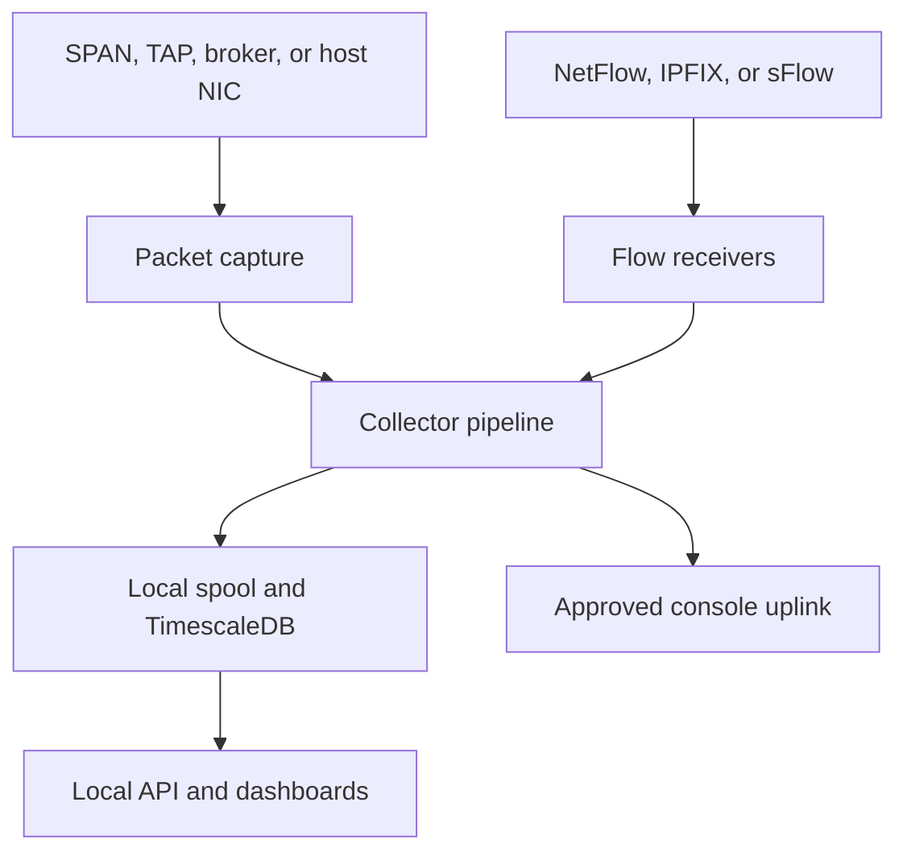

# NetTAP Network Intelligence Deployment Manual

Version: 0.2 deployment baseline
Repository: `mpdwyer2367/net-chat-insight`
Product status: development and controlled lab validation

## 1. Choose the correct deployment mode

NetTAP currently has several deployment paths. They serve different purposes and use different credentials.

| Mode | What runs | Best use | Credential |
| --- | --- | --- | --- |
| Web development | Vite application connected to Supabase | UI and workflow development | Supabase browser configuration |
| Standalone live capture | `dumpcap`, `tshark`, and HTTPS upload script | Fast Windows, macOS, or Linux ingestion test | Live-capture session token |
| Docker collector appliance | Postgres/TimescaleDB, collector, web tier, optional Ollama | Repeatable lab stack | Collector pairing token |
| Native collector | OS service plus local database | Persistent collector host | Collector pairing token |
| VM image build | Debian disk image generated by the experimental builder | Packaging development | Pairing token entered at first boot |

Do not substitute one token type for another. A website login token, Supabase browser token, collector pairing token, and live-capture session token are different credentials.

## 2. System flow



The standalone agent takes a shorter path: it captures five-second slices, converts them to newline-delimited JSON with `tshark -T ek`, and sends the decoded evidence directly to the hosted live-ingest endpoint.

## 3. Prerequisites shared by all capture modes

- Written authorization to capture the selected traffic
- A dedicated monitoring interface for SPAN, TAP, or packet-broker output when practical
- A separate management interface for production collectors
- Accurate host time and NTP synchronization
- Working DNS and HTTPS access to the selected console
- Wireshark command-line tools: `dumpcap` and `tshark`
- Adequate CPU, memory, disk, and interface capacity for the expected traffic rate

Official Wireshark packages and platform instructions are available from [wireshark.org](https://www.wireshark.org/download.html).

## 4. Standalone live-capture deployment

Use this mode to validate the current hosted endpoint before installing the complete collector appliance.

Default endpoint:

```text
https://net-chat-insight.lovable.app/api/public/live-ingest
```

Generate a fresh token immediately before the test:

1. Sign in to the NetTAP application.
2. Open **Live Capture**.
3. Create or select a capture session.
4. Select **Rotate token** or **Generate token**.
5. Select **Copy token**.
6. Paste only the token into the agent's hidden prompt.

Never add `Bearer`, quotation marks, or a label. Do not reuse a token exposed in chat, documentation, logs, or Git.

### Windows standalone agent

1. Install signed Wireshark packages with TShark and Npcap.
2. Open PowerShell as Administrator.
3. Verify:

```powershell
& "C:\Program Files\Wireshark\dumpcap.exe" --version
& "C:\Program Files\Wireshark\tshark.exe" --version
& "C:\Program Files\Wireshark\dumpcap.exe" -D
```

4. Run:

```powershell
Set-ExecutionPolicy -Scope Process -ExecutionPolicy Bypass
& ".\collector\deploy\live-capture\nettap-live-capture.ps1"
```

Use the numeric interface identifier printed by `dumpcap -D`.

### macOS standalone agent

1. Install Wireshark in `/Applications`.
2. Install the ChmodBPF helper from the Wireshark disk image or macOS Extras.
3. Verify:

```bash
export PATH="/Applications/Wireshark.app/Contents/MacOS:$PATH"
command -v dumpcap
command -v tshark
dumpcap -D
```

4. Run:

```bash
chmod 700 collector/deploy/live-capture/nettap-live-capture-macos.sh
bash collector/deploy/live-capture/nettap-live-capture-macos.sh
```

Do not paste the script body directly into interactive zsh. Save and execute the file with Bash.

### Linux standalone agent

For Debian or Ubuntu:

```bash
sudo apt update
sudo apt install tshark curl
sudo usermod -aG wireshark "$USER"
```

Sign out and back in after changing group membership. Then:

```bash
dumpcap -D
chmod 700 collector/deploy/live-capture/nettap-live-capture-linux.sh
bash collector/deploy/live-capture/nettap-live-capture-linux.sh
```

For RHEL-family systems, install the distribution-supported Wireshark CLI package, commonly `wireshark-cli`, and configure non-root `dumpcap` access according to the operating-system policy.

### Standalone acceptance result

A valid test must show:

- The intended interface is listed.
- The one-packet test succeeds.
- A non-empty capture and NDJSON slice are produced.
- HTTPS certificate validation succeeds.
- The endpoint returns HTTP `2xx`.
- The live-capture session count increases.

HTTP `401` means capture, decoding, DNS, TLS, and endpoint routing worked, but the live-capture session token was rejected.

## 5. Docker collector appliance

### Requirements

- Current Docker Engine and Docker Compose plugin
- Linux host recommended for packet capture
- Access to the capture interface and UDP flow ports
- A collector pairing token generated by the console
- Capacity matching one of the shipped profiles

### Configure

```bash
cd collector/deploy
cp .env.example .env
chmod 600 .env
```

Edit `.env` and replace every `CHANGE_ME` value. The internal `AMDAI_*` variable names are retained for compatibility with the current collector code. They do not change the NetTAP product name.

Do not pass tokens directly on a shared command line. Prefer a protected environment file or approved secret store.

Load the selected profile name into the current administrative shell before using it in a profile filename:

```bash
set -a
. ./.env
set +a
```

### Validate and start

Return to the repository root while preserving the exported values:

```bash
cd ../..
collector/scripts/preflight.sh \
  --profile "$AMDAI_PROFILE" \
  --console-url "${AMDAI_CONSOLE_URL}"
```

Then:

```bash
cd collector/deploy
docker compose --env-file .env \
  --env-file "profiles/$AMDAI_PROFILE.env" \
  config
docker compose --env-file .env \
  --env-file "profiles/$AMDAI_PROFILE.env" \
  up -d
docker compose ps
```

Optional Ollama profile:

```bash
docker compose --profile ollama --env-file .env \
  --env-file "profiles/$AMDAI_PROFILE.env" \
  up -d
```

The current Compose stack uses host networking for the collector so it can receive mirrored packets and UDP flow telemetry. Review host firewall rules before starting it.

## 6. Native Linux collector

Supported baseline: Debian/Ubuntu with `apt`, or RHEL-family Linux with `dnf`.

From the repository root:

```bash
sudo collector/deploy/install-linux.sh \
  --profile small \
  --console-url https://net-chat-insight.lovable.app
```

The existing installer accepts `--token`, but entering a secret on the command line may expose it through shell history or process inspection. For controlled deployment, omit the token, then place it in `/opt/amdai/collector.env` with root-controlled permissions or integrate an approved secret store.

Validate:

```bash
sudo systemctl status amdai-collector.service
sudo journalctl -u amdai-collector.service -n 100 --no-pager
curl -fsS http://127.0.0.1:8787/healthz
```

The service and filesystem names still use `amdai` for backward compatibility.

## 7. Native macOS collector

This path is intended for labs and small or medium profiles.

Requirements:

- Homebrew
- Xcode Command Line Tools
- Administrator access for ChmodBPF setup
- A normal user account, not a root shell

Run:

```bash
collector/deploy/install-macos.sh \
  --profile small \
  --console-url https://net-chat-insight.lovable.app
```

After installation, store the pairing token in the protected collector environment file identified by the installer. Restart the launch agent after updating the file.

Validate:

```bash
launchctl list | grep -E 'com\.amdai\.(collector|app)'
dumpcap -D
curl -fsS http://127.0.0.1:8787/healthz
```

Use Linux for sustained high-rate capture or large and XL profiles.

## 8. Native Windows collector

Requirements:

- Windows 11 or Windows Server
- Administrator PowerShell
- Wireshark, TShark, and Npcap
- PostgreSQL 16
- TimescaleDB installed for PostgreSQL
- Node.js
- NSSM recommended for service management

Run from elevated PowerShell:

```powershell
Set-ExecutionPolicy -Scope Process -ExecutionPolicy Bypass
& ".\collector\deploy\install-windows.ps1" `
  -Profile small `
  -ConsoleUrl "https://net-chat-insight.lovable.app"
```

The current installer can accept `-Token`, but do not use it on a shared system because the value can be retained in command history. Configure the protected service environment after installation.

Validate:

```powershell
Get-Service amdai-collector
Get-NetFirewallRule | Where-Object DisplayName -Like "AMDAI*"
Invoke-RestMethod http://127.0.0.1:8787/healthz
```

## 9. VMware and VirtualBox status

`collector/deploy/build-ova.sh` is currently an experimental disk-image builder. Despite its filename, the reviewed implementation produces a QCOW2 image and attempts a VMDK conversion. It does not yet generate a complete signed OVF descriptor, manifest, and final `.ova` archive.

Build example on a Linux host:

```bash
collector/deploy/build-ova.sh \
  --profile small \
  --output ./dist \
  --builder auto \
  --console-url https://net-chat-insight.lovable.app
```

Current outputs may include:

- `amdai-collector-small.qcow2`
- `amdai-collector-small.vmdk`
- Packer build directories

For VMware testing, create a new Linux VM with the profile's required CPU, memory, and disk, attach the generated VMDK, assign separate management and monitoring network adapters, then boot and complete pairing.

For VirtualBox testing, import or attach the generated disk only after conversion to a VirtualBox-supported disk format. A fully validated one-click OVA is still release work and must not be advertised as available yet.

## 10. Capacity profiles

| Profile | vCPU | RAM | Disk | Flow ceiling | Capture ceiling |
| --- | ---: | ---: | ---: | ---: | ---: |
| small | 4 | 8 GB | 100 GB | 5,000 flows/s | 200 Mbps |
| medium | 8 | 32 GB | 1 TB | 50,000 flows/s | 1 Gbps |
| large | 16 | 64 GB | 2 TB | 120,000 flows/s | 5 Gbps |
| xl | 32 | 128 GB | 4 TB | 200,000 flows/s, 250,000 burst | 10 Gbps |

These are design profiles, not independent performance certifications. Validate them with representative packet sizes, protocol mixes, burst patterns, decoding depth, storage, and enabled analytics before publishing performance claims.

## 11. Release acceptance checklist

- Fresh installation succeeds on each claimed operating system.
- No real secret exists in Git history, examples, logs, or screenshots.
- Capture works as a non-root or least-privilege service.
- Flow ports bind and receive test exporters.
- Database schema and TimescaleDB extension validate.
- Health endpoints pass after restart.
- Pairing token is single-use, revocable, tenant-bound, and not logged.
- Capture loss and shed-stage behavior are measured under load.
- Failed data is bounded by spool quotas and retention.
- Backup and restore are tested, not only documented.
- Upgrade and rollback are tested from the prior release.
- VMware and VirtualBox artifacts import and boot on the exact supported versions.
