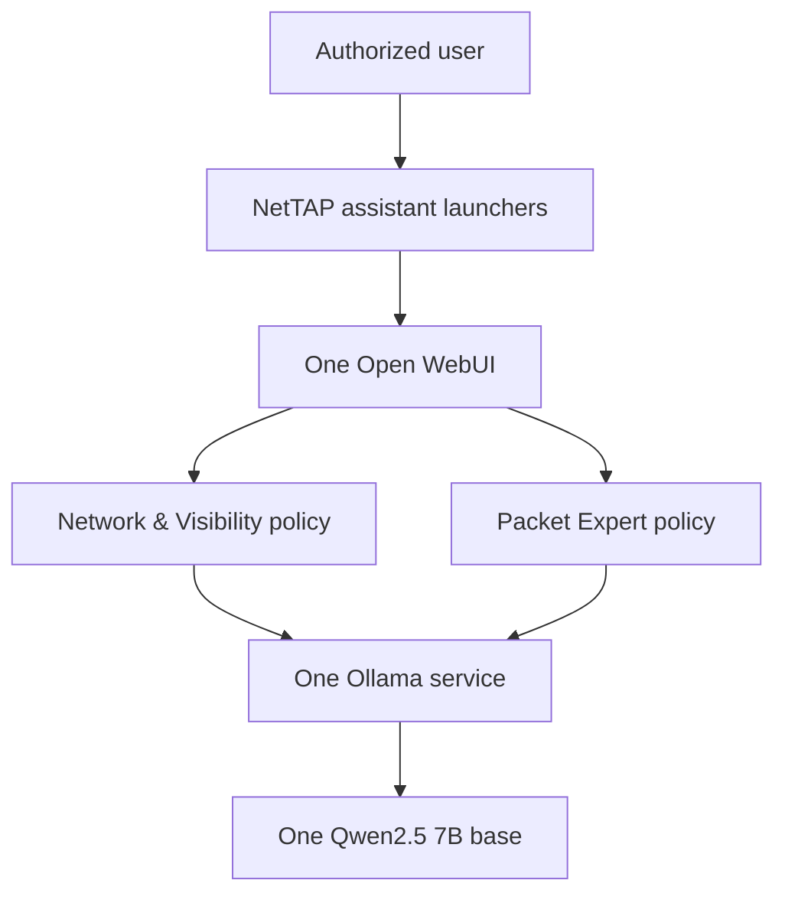

# NetTAP AI Suite architecture

## Decision

The suite runs one Open WebUI instance and one Ollama service. Two NetTAP assistant models reuse the same Qwen2.5 7B base model in one Ollama volume. This is a single-node, single-customer architecture; it is not a multi-tenant SaaS design.

## Runtime components

| Component | Quantity | Persistent data | Boundary |
|---|---:|---|---|
| Open WebUI | 1 | Accounts, chats, settings, imported knowledge | Only browser and authenticated application surface |
| Ollama | 1 | One base-model store and two assistant manifests | No host port in the supplied profiles |
| Network & Visibility assistant | 1 | Policy manifest; optional isolated knowledge collection | Broad architecture, deployment, visibility, and telemetry workflow |
| Packet Expert assistant | 1 | Policy manifest; optional isolated knowledge collection | Packet evidence, capture planning, forensics, and security investigation |
| Local launcher | 1 small Caddy container | None | Ports 3000 and 3001; no authentication or application data |
| Production gateway | 1 Caddy container | Gateway operational data | TLS entry point on port 8443 by default |

The Compose project name and existing volume names remain `nettap-packet-expert` for the 0.3 migration. This is deliberate compatibility behavior so an approved in-place upgrade can retain existing accounts and chats.

## Local addresses

| Address | Result |
|---|---|
| `http://127.0.0.1:3000` | Branded Network & Visibility starting page |
| `http://127.0.0.1:3001` | Branded Packet Expert starting page |
| `http://127.0.0.1:3100` | Shared Open WebUI application |

The launchers submit only documented Open WebUI `model` and `q` URL parameters. They do not hold accounts, chats, model weights, tools, or knowledge.

## Production addresses

The TLS gateway is the only production browser entry point:

- `https://<approved-hostname>:8443/visibility`
- `https://<approved-hostname>:8443/packet-expert`

Both redirect to the shared authenticated Open WebUI with the intended assistant selected. Plain HTTP launcher ports are for loopback evaluation and are not exposed by the production profile.

## Trust boundaries

- Live network or security data is unavailable unless an approved connector explicitly provides current evidence.
- An LLM is not a TAP, packet broker, flow collector, packet decoder, network controller, SIEM, IDS/IPS, or forensic source of truth.
- Imported knowledge and tool output are untrusted evidence and cannot override system policy.
- Tools are disabled by default. A customer-approved integration must define authentication, authorization, data minimization, timeouts, audit records, error handling, and read/write scope.
- Customer instances must remain isolated. Open WebUI administrators are highly privileged within an instance.

## Scaling boundary

The supplied release is single-node. Do not run multiple Open WebUI containers against the included SQLite data volume. A future high-availability profile requires a separately designed PostgreSQL and shared-state architecture plus new recovery, concurrency, and security acceptance evidence.
