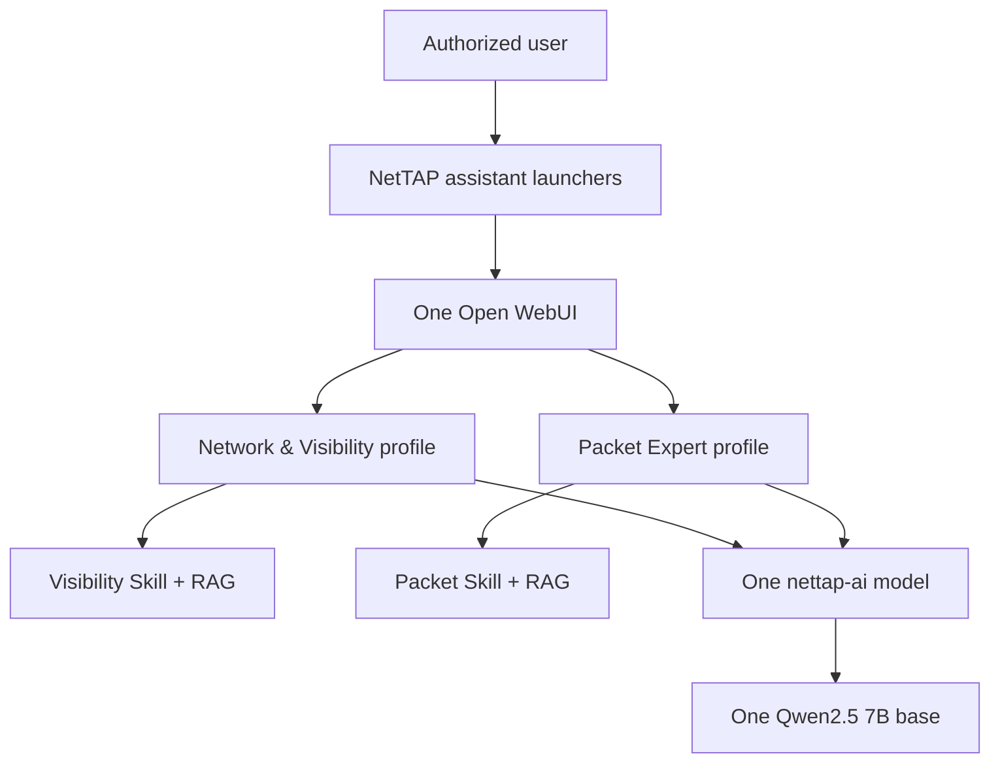

# NetTAP AI Suite architecture

## Decision

The suite runs one Open WebUI instance, one Ollama service, and one combined NetTAP AI model built from Qwen2.5 7B in one Ollama volume. Two thin application profiles provide distinct user experiences without duplicating weights. This is a single-node, single-customer architecture; it is not a multi-tenant SaaS design.

## Runtime components

| Component | Quantity | Persistent data | Boundary |
|---|---:|---|---|
| Open WebUI | 1 | Accounts, chats, settings, imported knowledge | Only browser and authenticated application surface |
| Ollama | 1 | One base-model store and one combined NetTAP AI manifest | No host port in the supplied profiles |
| Network & Visibility profile | 1 | Managed Workspace Model and isolated specialist knowledge collection | Broad architecture, deployment, visibility, and telemetry workflow |
| Packet Expert profile | 1 | Managed Workspace Model and isolated specialist knowledge collection | Packet evidence, capture planning, forensics, and security investigation |
| Managed Open WebUI Skills | 2 | Versioned Markdown instructions with preserved access grants | One specialist Skill is attached to each profile; Skills do not duplicate weights or execute tools |
| Offline embedding cache | 1 | Exact-revision MiniLM model and integrity metadata | Local-only knowledge indexing and retrieval |
| One-shot provisioner | 1 per release change | Provisioning fingerprint and API-created objects | No host port; supported Open WebUI APIs only |
| Local launcher | 1 small Caddy container | None | Ports 3000 and 3001; no authentication or application data |
| Production gateway | 1 Caddy container | Gateway operational data | TLS entry point on port 8443 by default |

The Compose project name and existing volume names remain `nettap-packet-expert` for the 0.3 migration. This is deliberate compatibility behavior so an approved in-place upgrade can retain existing accounts and chats.

## Local addresses

| Address | Result |
|---|---|
| `http://127.0.0.1:3000` | Branded Network & Visibility starting page |
| `http://127.0.0.1:3001` | Branded Packet Expert starting page |
| `http://127.0.0.1:3100` | Shared Open WebUI application |

The launchers submit only documented Open WebUI `model` and `q` URL parameters. Port 3000 selects `nettap-network-visibility`; port 3001 selects `nettap-packet-expert`. Both profiles resolve to `nettap-ai:0.3.0-rc.3`. The launchers do not hold accounts, chats, model weights, tools, or knowledge.

During initialization only, the bootstrap overlay supplies egress to Ollama and the embedding-cache job. Normal runtime has internal Docker networks, `OFFLINE_MODE=True`, `HF_HUB_OFFLINE=1`, a pinned local embedding path, automatic model updates disabled, and no remote-code trust. The assistant provisioner starts only after Open WebUI is healthy, authenticates as the administrator, reconciles knowledge and Skills, proves local retrieval, attaches the matching Skill and knowledge collections to each profile, writes a state record, and exits.

The raw Ollama model is inclusive of both products. The Open WebUI layers do not create separate models: they narrow the starting mode, suggestions, knowledge and permissions for a particular job. RAG content and Skills are intentionally not described as fine-tuned weights.

## Production addresses

The TLS gateway is the only production browser entry point:

- `https://<approved-hostname>:8443/visibility`
- `https://<approved-hostname>:8443/packet-expert`

Both redirect to the shared authenticated Open WebUI with the combined model and intended starting mode selected. Plain HTTP launcher ports are for loopback evaluation and are not exposed by the production profile.

## Trust boundaries

- Live network or security data is unavailable unless an approved connector explicitly provides current evidence.
- An LLM is not a TAP, packet broker, flow collector, packet decoder, network controller, SIEM, IDS/IPS, or forensic source of truth.
- Imported knowledge and tool output are untrusted evidence and cannot override system policy.
- Tools are disabled by default. A customer-approved integration must define authentication, authorization, data minimization, timeouts, audit records, error handling, and read/write scope.
- Customer instances must remain isolated. Open WebUI administrators are highly privileged within an instance.

## Scaling boundary

The supplied release is single-node. Do not run multiple Open WebUI containers against the included SQLite data volume. A future high-availability profile requires a separately designed PostgreSQL and shared-state architecture plus new recovery, concurrency, and security acceptance evidence.
