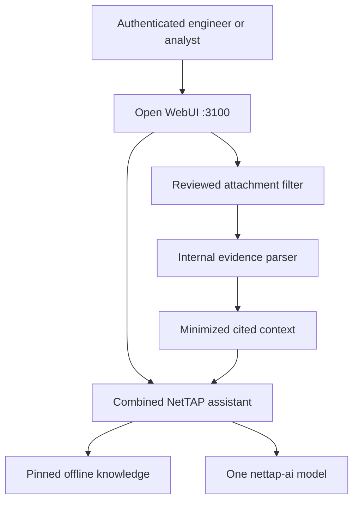

# Application architecture

NetTAP Network Observability & Packet Analysis has one authenticated user interface and one managed assistant. Network-design, observability, troubleshooting, packet-analysis, security and forensic guidance are combined without duplicating the 7B model weights.

| Boundary | Responsibility | Exposure |
|---|---|---|
| Open WebUI | Authentication, chat, attachment upload, history and administration | `127.0.0.1:3100` locally; TLS gateway in production |
| Managed assistant | One prompt, Skill and combined NetTAP knowledge binding | Inside Open WebUI |
| Ollama | Qwen2.5 7B base and `nettap-ai:0.3.0-rc.7` manifest | Docker backend only |
| Evidence service | Hashing, parsing, normalization, deterministic findings and provenance | Docker backend only |
| Evidence volume | Original files, case records and deterministic results | Docker volume; never a public UI |
| Offline RAG | Pinned embedding model and three managed knowledge collections | Open WebUI data volume |

## Attachment sequence

1. An authenticated user attaches a supported file in chat.
2. The managed Filter resolves the server-side upload, verifies the extension and sends its bytes to the private evidence service.
3. The service hashes and stores the original, applies the supported parser and creates normalized observations and bounded findings.
4. Only minimized context—evidence IDs, hashes, quality warnings, observations, hypotheses and limitations—is injected into the model prompt.
5. The assistant produces a professional assessment and cites the evidence identifiers. Raw packet payloads, credentials and TLS secrets are not copied into the prompt.

## Supported inputs and limits

| Input | Built-in handling |
|---|---|
| Classic PCAP | Ethernet and raw-IP metadata/flow analysis |
| JSON/JSONL/NDJSON | Validated structured records within configured limits |
| LOG/TXT | Deterministic line-oriented normalization |
| PCAPNG | Not yet supported; convert with an approved local tool |
| Binary IPFIX, NetFlow or sFlow | Not decoded; export to a documented JSON/JSONL schema first |
| Live telemetry | Not connected by this release |
| Encrypted payload | Not decrypted; authorized decryption occurs outside the LLM boundary |

Normal runtime is offline. Temporary egress exists only during controlled image, base-model and pinned-embedding initialization, then is removed. Ollama and evidence processing publish no host ports.

## Persistent data

- `nettap-network-intelligence_packet-expert-open-webui-data`: accounts, chats, settings, knowledge, embedding cache and provisioning state.
- `nettap-network-intelligence_packet-expert-ollama-data`: base and NetTAP model manifests/blobs.
- `nettap-network-intelligence_packet-expert-evidence-data`: original evidence, hashes and analysis records.

The historical volume suffixes remain for upgrade compatibility; product-facing naming is defined in [Naming conventions](NAMING_CONVENTIONS.md).
