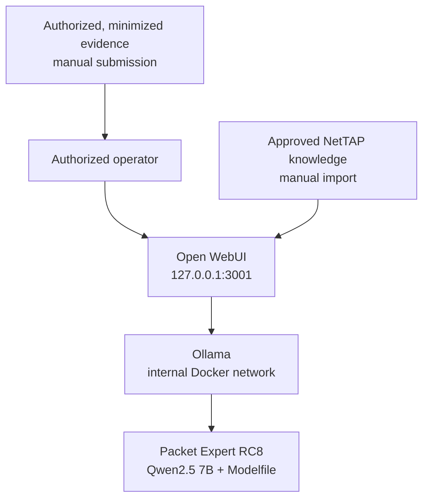

# NetTAP Packet Expert complete operations manual

**Release:** `0.1.0-rc.8`  
**Canonical repository:** <https://github.com/mpdwyer2367/nettap-packet-expert>  
**Canonical model:** `nettap-packet-expert:0.1.0-rc.8`  
**Canonical local URL:** <http://127.0.0.1:3001>  
**Audience:** NetTAP administrators, maintainers, release engineers, evaluators, and support personnel

## 1. Purpose and current release boundary

NetTAP Packet Expert is a local network-operations and security-operations assistant. RC8 combines a pinned Open WebUI container, a pinned Ollama container, a Qwen2.5 7B quantized base model, and a version-controlled NetTAP Modelfile.

This package creates a custom Ollama model definition; it does not contain separately fine-tuned weights. The base model is downloaded from the Ollama registry during initialization. The custom behavior is built from `model/Modelfile`.

RC8 is a release candidate. Source checks pass in the repository, but it is not a generally available, fully certified appliance. macOS runtime acceptance must be run on each advertised Apple silicon and Intel configuration. Windows runtime acceptance is manual in RC8.

## 2. Canonical deployment identity

Use all of these identifiers together. A matching page title or container name alone is not proof that a deployment is current.

| Item | RC8 source of truth |
|---|---|
| Repository | `https://github.com/mpdwyer2367/nettap-packet-expert` |
| Release | `0.1.0-rc.8` |
| Expected Git commit at publication | Record the commit shown on the GitHub release or deployment acceptance record |
| Compose project | `nettap-packet-expert` |
| Custom model | `nettap-packet-expert:0.1.0-rc.8` |
| Base model | `qwen2.5:7b-instruct-q4_K_M` |
| Web UI | `http://127.0.0.1:3001` |
| Open WebUI image | `ghcr.io/open-webui/open-webui:v0.11.0` |
| Ollama image | `ollama/ollama:0.32.5` |
| Fresh administrator | `admin@nettap.local` |
| Temporary password | `admin`—replace immediately |

Treat port `3000`, a different model tag, a different Compose project, or an unknown working directory as a legacy or separate deployment until inspected.

## 3. Architecture and data boundary



The browser is bound to host loopback. Ollama is not published on a host port. Docker named volumes retain Open WebUI accounts, chats, settings, knowledge, and Ollama models.

The package does not automatically capture an interface, inspect a PCAP, connect to a NetTAP NPB, ingest IPFIX, or receive live telemetry. Any such integration requires a separately engineered, authorized, and validated collection and normalization path. The assistant must never imply that data is live when it is not.

## 4. Before cleanup: inventory every deployment

Do not delete containers or volumes merely because they appear old. An Open WebUI volume may contain the only copy of an administrator account, chats, model presets, knowledge, or settings.

From the canonical repository on macOS:

```bash
git pull --ff-only
chmod +x scripts/inventory-macos.sh
./scripts/inventory-macos.sh | tee "$HOME/Desktop/NetTAP_Packet_Expert_inventory.txt"
```

The inventory is read-only. It reports Compose projects, containers, ports, volumes, native and containerized Ollama models, and likely NetTAP Git working copies. It deliberately does not print environment values or password hashes.

Classify each deployment as:

- **Canonical candidate:** correct repository, Compose project, model tag, images, and port.
- **Preserve pending review:** contains unique users, chats, knowledge, or models.
- **Legacy, safe to stop:** not canonical and its required data has been backed up or confirmed unnecessary.
- **Unknown:** provenance or ownership cannot be established; do not alter it.

## 5. Safe consolidation and cleanup

### 5.1 Stop without deleting data

For the canonical repository:

```bash
./scripts/stop.sh
```

For another identified Compose project, run `docker compose down` from its exact working directory with its exact Compose file. This stops its containers and network but preserves named volumes. Do not use `-v`.

If the inventory shows a standalone container whose project cannot be established, record its name and volume mounts before using `docker stop CONTAINER_NAME`. Do not remove it during initial consolidation.

### 5.2 Back up persistent volumes before removal

First list the exact volume names and create a private backup directory:

```bash
docker volume ls
mkdir -p "$HOME/NetTAP-Backups"
```

Back up one exact named volume at a time. Replace `EXACT_VOLUME_NAME` with a name copied from the inventory:

```bash
docker run --rm \
  -v EXACT_VOLUME_NAME:/source:ro \
  -v "$HOME/NetTAP-Backups":/backup \
  alpine:3.20 \
  tar -czf /backup/EXACT_VOLUME_NAME.tgz -C /source .
```

Record a checksum:

```bash
shasum -a 256 "$HOME/NetTAP-Backups/EXACT_VOLUME_NAME.tgz"
```

Test that the archive can be listed:

```bash
tar -tzf "$HOME/NetTAP-Backups/EXACT_VOLUME_NAME.tgz" >/dev/null
```

Volume deletion is a separate, destructive maintenance decision. Perform it only after the exact target, backup, checksum, restore test, and retention approval are documented.

### 5.3 Restore a volume

Stop the owning Compose project. Create a new, explicitly named volume, then restore the archive:

```bash
docker volume create RESTORED_VOLUME_NAME
docker run --rm \
  -v RESTORED_VOLUME_NAME:/restore \
  -v "$HOME/NetTAP-Backups":/backup:ro \
  alpine:3.20 \
  sh -c 'cd /restore && tar -xzf /backup/EXACT_VOLUME_NAME.tgz'
```

Do not attach a restored database simultaneously to two Open WebUI containers. Update the reviewed Compose mapping, start one deployment, and complete account, chat, knowledge, and health checks.

## 6. Clean canonical deployment on macOS

### Prerequisites

- macOS on Apple silicon or Intel
- Docker Desktop running with Compose v2
- Git
- 16 GB RAM recommended
- At least 15 GB free disk

Install into a clearly named working directory. If another directory with that name exists, do not overwrite it; inventory it first.

```bash
git clone https://github.com/mpdwyer2367/nettap-packet-expert.git
cd nettap-packet-expert
chmod +x scripts/*.sh tests/*.sh
./tests/static-checks.sh
./scripts/start-macos.sh
```

Open <http://127.0.0.1:3001>. The first start downloads the container images and approximately 4.7 GB base model, creates the custom model, and starts the UI.

### First administrator session

1. Sign in as `admin@nettap.local` with password `admin`.
2. Open **Settings > Account**.
3. Replace the password with a unique 12–72 character password containing uppercase, lowercase, number, and symbol.
4. Sign out and verify that `admin` fails.
5. Sign in with the replacement password.
6. Confirm the selected model is `nettap-packet-expert:0.1.0-rc.8`.

The bootstrap account is created only when the Open WebUI database is empty. Existing volumes retain their existing accounts and passwords.

### Import approved knowledge

1. Open **Workspace > Knowledge**.
2. Create `NetTAP Packet Expert`.
3. Upload `knowledge/NetTAP_Packet_Expert_Knowledge.md`.
4. Wait for processing.
5. Open **Workspace > Models** and attach the knowledge base to the Packet Expert model or model preset.
6. Test a new chat and verify the response distinguishes supplied information from unavailable live data.

Updating the Git Markdown does not update an already imported Open WebUI knowledge base. Re-import the approved revision and verify model attachment.

RC8 does not include a separate Open WebUI Workspace Skill. Its operational workflow and guardrails are embedded in `model/Modelfile`.

## 7. Clean canonical deployment on Windows

### Prerequisites

- Windows 11 or supported Windows 10
- Hardware virtualization and WSL 2
- Docker Desktop using Linux containers
- Git and PowerShell
- 16 GB RAM recommended
- At least 15 GB free disk

Run from normal-user PowerShell:

```powershell
git clone https://github.com/mpdwyer2367/nettap-packet-expert.git
Set-Location .\nettap-packet-expert
.\scripts\start-windows.ps1
```

If execution policy blocks the local script:

```powershell
powershell -ExecutionPolicy Bypass -File .\scripts\start-windows.ps1
```

Open <http://127.0.0.1:3001>, complete the same password change and knowledge import, then run the Windows checks in `docs/WINDOWS_DEPLOYMENT.md`.

## 8. Daily administration

### macOS commands

| Task | Command |
|---|---|
| Start or complete initialization | `./scripts/start-macos.sh` |
| Show services and Ollama models | `./scripts/status.sh` |
| Follow logs | `docker compose --env-file .env -f compose.yaml logs -f --tail 200` |
| Restart services | `docker compose --env-file .env -f compose.yaml restart` |
| Stop and preserve data | `./scripts/stop.sh` |
| Rebuild after reviewed Modelfile change | `./scripts/update-model.sh --confirm` |
| Run static checks | `./tests/static-checks.sh` |
| Run macOS acceptance | `./tests/macos-e2e.sh` |

### Windows commands

```powershell
$compose = @('compose', '--env-file', '.env', '-f', 'compose.yaml')
docker @compose ps
docker @compose logs --tail 200 ollama open-webui
docker @compose restart
docker @compose down
```

`down` preserves named volumes. Never add `-v` during routine operation.

## 9. Health and acceptance checks

See [`VALIDATION_STATUS.md`](VALIDATION_STATUS.md) for the authoritative distinction between source validation, automated runtime verification, manual acceptance, and release acceptance.

On macOS:

```bash
./scripts/status.sh
curl --fail http://127.0.0.1:3001/health
./scripts/verify-macos-deployment.sh
./tests/macos-e2e.sh
```

Manual acceptance must also confirm:

- `admin@nettap.local / admin` works only on a fresh volume.
- The administrator changes the password and the old password fails.
- The new password survives service restart.
- The correct custom model is selected and responds.
- The four broad starter prompts appear.
- No response claims access to unconnected live traffic or telemetry.
- The imported knowledge is attached and accessible to authorized users.
- The UI remains bound to loopback.
- No customer evidence, secret, credential, or personal data is in the release image or test record.

Save the generated acceptance report under `reports/`, remove sensitive host/user details if necessary, and attach the approved report to the GitHub release.

## 10. Account and access administration

- Keep `BIND_ADDRESS=127.0.0.1` for the supplied local profile.
- Signup is disabled by default.
- Do not publish `.env`; it contains the WebUI secret and bootstrap settings.
- Do not assume `admin@nettap.local / admin` can reset an existing database.
- Follow `docs/AUTHENTICATION.md` for supported account inspection and password recovery.
- Before multi-user or network exposure, design TLS termination, identity, authorization, source restrictions, audit, backup, retention, threat modeling, and penetration testing.

The RC8 banner asks the administrator to replace the temporary password. Stock Open WebUI does not technically force a first-login password reset, so the release acceptance process must verify it.

## 11. Updating the model and application

### Model behavior change

1. Create a Git branch.
2. Edit `model/Modelfile` through peer review.
3. If the release identity changes, update `MODEL_NAME` in `.env.example`, Compose references, tests, documentation, and reports together.
4. Run `./tests/static-checks.sh`.
5. Rebuild locally with `./scripts/update-model.sh --confirm`.
6. Run `./tests/macos-e2e.sh` and manual acceptance.
7. Record the base model, Modelfile commit, image digests, host, and results.
8. Merge only after review.

### Open WebUI or Ollama image update

1. Review vendor release notes and security advisories.
2. Change only the pinned image tag in `.env.example`.
3. Back up both named volumes.
4. Pull and test on a non-production host.
5. Test authentication, password change, existing data migration, model discovery, knowledge, prompts, inference, health, restart, backup, and restore.
6. Record image digests, not only mutable tags.
7. Publish a new release candidate; do not silently change an existing release.

### Knowledge update

1. Edit the Markdown on a branch.
2. Review for technical accuracy, authorization, privacy, and unsupported claims.
3. Merge and tag the approved revision.
4. Re-import it into Open WebUI and reattach it to the intended model.
5. Run retrieval and access-control checks.

## 12. GitHub maintenance and release workflow

### Normal contribution workflow

```bash
git switch main
git pull --ff-only
git switch -c docs/short-description
# edit and validate
git status --short
git diff --check
./tests/static-checks.sh
git add <reviewed-files>
git commit -m "Describe the reviewed change"
git push -u origin docs/short-description
```

Open a pull request, require review, and merge after checks pass. Protect `main`; require pull requests and passing CI. Do not commit secrets, `.env`, production captures, customer evidence, model registry credentials, or private reports.

### Release procedure

1. Confirm the repository is clean and CI passes.
2. Complete runtime acceptance on each advertised platform.
3. Update version strings consistently.
4. Prepare release notes: capability changes, security changes, migrations, known limitations, checksums, and acceptance status.
5. Create an annotated tag such as `v0.1.0-rc.9`.
6. Push the tag and create a GitHub release from that exact commit.
7. Attach sanitized acceptance reports and distributable source archives if approved.
8. Keep prior tags immutable; publish a new version for fixes.

### Rollback

- Keep the previous Git tag, image tags/digests, and verified volume backups.
- Stop the failed deployment without deleting volumes.
- Restore a compatible backup only after confirming database compatibility.
- Check out the prior tag in a separate directory and start one deployment.
- Repeat health, identity, authentication, knowledge, and inference checks.
- Record the reason, owner, data impact, and final state.

## 13. Sharing the project

Share the public repository URL and a specific release tag, not an unversioned folder or an old archive. Recipients should receive:

- repository and release URL;
- platform prerequisites;
- deployment guide;
- temporary account procedure;
- security and evidence boundary;
- acceptance status and known limitations;
- support and vulnerability-reporting path;
- checksum for any attached archive.

The repository is public, but no license has yet been selected for NetTAP-authored source. Public visibility does not grant open-source redistribution, modification, or contribution rights. Add a NetTAP-approved license and contributor policy before inviting redistribution or external contributions.

## 14. Troubleshooting decision path

### Wrong or unavailable URL

Run `./scripts/status.sh`, check logs, and run the inventory. RC8 defaults to `127.0.0.1:3001`. Port 3000 usually indicates another deployment.

### Administrator login fails

If the volume already contains a user, bootstrap credentials do not apply. Use the account inspection procedure in `docs/AUTHENTICATION.md`; do not delete the database.

### Model missing

Run `./scripts/update-model.sh --confirm`, then verify `nettap-packet-expert:0.1.0-rc.8` appears in `./scripts/status.sh`.

### Old suggestions remain

Open WebUI persistent configuration can retain earlier suggestions. Update the administrator setting or migrate approved data to a fresh, validated volume. Do not delete the old volume to fix prompts.

### Generic knowledge answers

Confirm processing completed, the knowledge base is attached to the selected model/preset, and the user has permission to read it.

### Port conflict

Use the inventory to identify the listener. Stop the exact legacy project after backup, or change `WEB_PORT` in the canonical `.env` and use that loopback URL.

### Slow Apple silicon inference

The containerized Ollama profile is CPU-compatible. It does not use Apple Metal. Do not describe it as GPU-accelerated.

## 15. Current limitations and release decision

RC8 can be shared for controlled evaluation when the platform acceptance report passes and the recipient understands the limitations. It should not yet be represented as a fully validated production appliance because:

- platform runtime acceptance is not complete for every target configuration;
- knowledge import is manual;
- no formal Open WebUI Workspace Skill package is included;
- no live capture, IPFIX, telemetry, NPB, or PCAP-processing integration is included;
- automated backup/restore and Windows E2E automation are not included;
- forced password change is procedural, not technically enforced;
- no NetTAP source license has been selected.

These boundaries are release controls, not optional wording. Close and test them before a production or commercially licensed appliance claim.

## 16. Operator handoff checklist

- [ ] Inventory existing Docker, Open WebUI, Ollama, ports, volumes, models, and Git copies.
- [ ] Identify the canonical RC8 deployment by repository, project, tag, images, and port.
- [ ] Back up and checksum every volume selected for preservation.
- [ ] Stop legacy deployments without `-v`.
- [ ] Deploy from the canonical GitHub repository.
- [ ] Run static and runtime acceptance.
- [ ] Change the temporary administrator password and verify persistence.
- [ ] Import and attach the approved knowledge revision.
- [ ] Confirm the model never claims unavailable live evidence.
- [ ] Record host, versions, image digests, commit, tests, owner, and date.
- [ ] Protect GitHub `main` and release from an immutable tag.
- [ ] Select an approved license before external redistribution or contributions.

## 17. Support escalation record

For every incident or support case, record:

- date/time and operator;
- host OS and architecture;
- Git commit and release tag;
- Docker Desktop, Compose, image tags and digests;
- Compose project and working directory;
- custom model tag;
- exact URL and bind address;
- symptoms and timestamps;
- commands run and results;
- backup/checksum status;
- data or security impact;
- recovery action and validation.

Do not include passwords, secrets, authentication tokens, private packet payloads, or unminimized customer evidence in GitHub issues or public logs.
