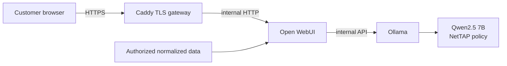

# Production architecture

## Decision

The supported commercial candidate is a single-node, single-customer Docker software appliance. A customer receives an isolated instance with its own host, volumes, TLS identity, administrator, backups, evidence boundary, and release record. High availability and cross-customer multi-tenancy are not claimed by this release.

## Runtime data flow

Only the gateway publishes a production port. Open WebUI and Ollama remain on internal Docker networks. The model registry network exists only while an administrator explicitly initializes or updates the model, and the startup process removes it before ordinary runtime.

## Trust boundaries

| Boundary | Control | Residual responsibility |
|---|---|---|
| User to appliance | Customer TLS, authentication, disabled signup | Customer DNS, PKI, firewall, endpoint security |
| WebUI to model | Internal Docker network; no host Ollama port | Host and Docker daemon are privileged boundaries |
| Evidence to model | Data minimization; evidence treated as untrusted | Customer authorization, classification, retention |
| Image supply chain | Immutable digests, SBOM, CVE gate | Authorized exception process and re-scan cadence |
| Persistent state | Named volumes, protected backup/restore | Host-disk encryption and off-host backup protection |
| Administration | Generated bootstrap, explicit retirement, CLI gates | Named operators, MFA/SSO roadmap, log collection |

Open WebUI administrators can access and control the application instance. They are equivalent to root within that tenant boundary. Separate customers must not share one instance.

## Component responsibility

| Component | Responsibility | Explicit non-capability |
|---|---|---|
| Caddy | TLS termination and security headers | Customer identity provider |
| Open WebUI | Authentication, chat, model and knowledge access | Strong tenant isolation inside one instance |
| Ollama | Local model serving and model storage | Network capture or telemetry collector |
| Packet Expert model | Evidence-disciplined advisory reasoning | Autonomous remediation or forensic proof |
| NetTAP TAP/NPB | Separately supplied traffic visibility | Included by this software repository |

## Availability and recovery

This is a single-node design. A host or volume failure causes service interruption. Recovery uses a verified backup restored into new volumes on a replacement host, followed by exact image/model rehydration and acceptance tests. A future HA edition requires shared-state architecture, tested failover, concurrency evaluation, and a separate certification.

## Sizing

Production preflight enforces at least 8 CPUs, 16 GiB Docker memory, and 40 GiB free disk. For more than a small number of concurrent users, performance must be benchmarked with representative prompt length, retrieval context, and concurrency before sale. GPU acceleration is not part of the certified candidate profile.
