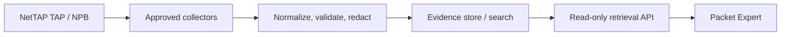

# Product roadmap

This roadmap separates implemented candidate capability from future commercial editions. Dates and commitments require product approval.

## Stage 1 — hardened advisory candidate

Implemented in `0.3.0-rc.1`:

- Qwen3 8B plus versioned NetTAP Ollama and Open WebUI policies
- local evaluation and TLS single-customer profiles
- generated administrator activation and fail-closed production start
- internal-only model runtime and temporary registry egress
- immutable container digests and expected base-model identity
- metadata audit logs, resource/log limits, backup/restore, SBOM/CVE gate
- signed source packaging, runtime verification, and explicit certification evidence gate

Exit: physical macOS/Windows reports, expanded model eval, recovery test, penetration test, legal/branding, support, signed acceptance.

## Stage 2 — sellable managed software appliance

Required before a licensed customer offer:

- entitlement/license service with offline grace policy and privacy review
- installer/upgrade manager with signed updates, rollback, migration and EOL policy
- enterprise identity profile (OIDC/SAML, MFA, lifecycle and group mapping)
- centralized immutable audit export and customer SIEM integration
- tested performance tiers, concurrency limits and supported-host matrix
- support bundle with redaction, SLA/escalation, vulnerability response and recovery objectives
- customer deployment automation and acceptance package

Exit: commercially approved software distribution for the defined host matrix. This is still not an OVA.

## Stage 3 — NetTAP visibility integration

Build collectors as separate least-privilege services, not inside the language-model process:

Prioritized inputs:

1. IPFIX/NetFlow metadata with exporter templates, clock/source validation and retention;
2. syslog with authenticated TLS where supported;
3. SNMPv3 and read-only gNMI with vendor/model capability profiles;
4. customer-approved REST/webhook/file feeds with schema validation;
5. PCAP through a sandboxed, resource-limited TShark extraction service that returns normalized metadata by default.

Every connector needs authorization, provenance, tenant isolation, rate/size limits, schema versioning, back-pressure, duplicate handling, encryption, secret rotation, audit, retention, health, test fixtures and failure semantics. Raw packet payload must not be sent to the LLM by default.

Exit: feed-specific conformance and security reports plus evidence that the assistant accurately labels data as live, uploaded, retrieved, or unavailable.

## Stage 4 — virtual appliance

Build separate AMD64 and ARM64 images from a minimal supported Linux OS using reproducible Packer pipelines. Package VMware-compatible OVF/OVA only against a supported hypervisor/guest architecture matrix; do not claim an ARMv8 VirtualBox builder unless Packer/VirtualBox officially supports that exact path.

Required appliance controls:

- first-boot network/DNS/NTP/PKI/admin/licensing wizard
- signed OS/container/model update channels with A/B or snapshot rollback
- secure boot where supported, host firewall, disk encryption/key handling
- `mvi-cli` for status, feeds, certificates, backup, diagnostics and reset
- appliance health, support bundle, factory reset and recovery media
- SBOM for OS and application, CIS hardening evidence, vulnerability and penetration tests
- VMware/VirtualBox validation on every advertised architecture

Exit: signed OVA/OVF/VMDK, checksums, installation guide, platform acceptance, recovery test, support lifecycle and commercial approval.

## Stage 5 — scale and resilience

For larger teams or HA, replace single-node SQLite/vector state with supported PostgreSQL, Redis and external vector/object storage; add replica-safe session/state design, load balancing, observability, capacity tests, failover, backup consistency and disaster-recovery exercises. This is a different certification scope.
